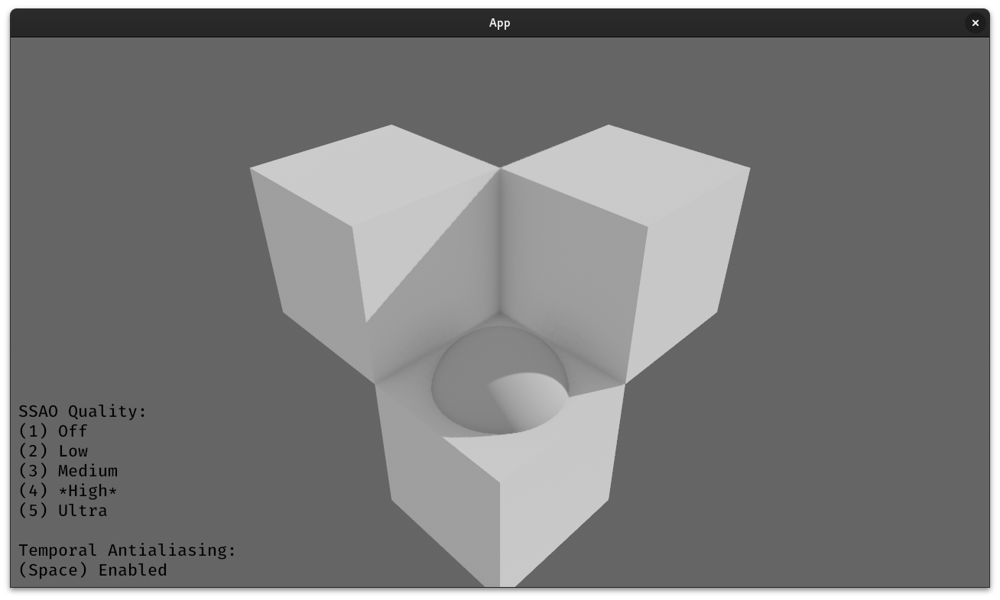
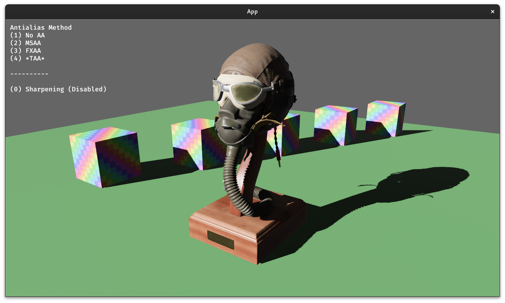
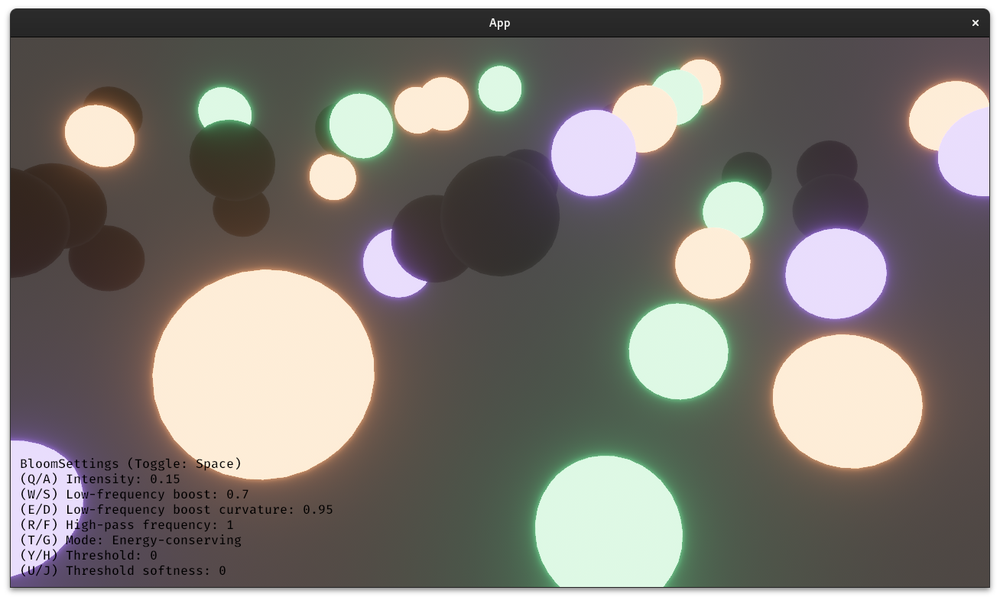
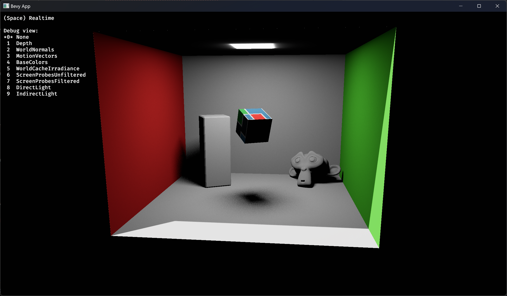
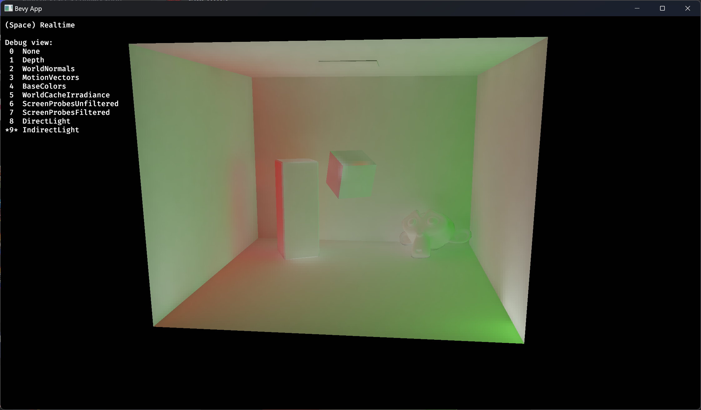

+++
title = "Bevy's Third Birthday - Reflections on Rendering"
date = "2023-09-12"

[taxonomies]
tags = ["bevy"]
+++

> Written in response to [Bevy's Third Birthday](https://bevyengine.org/news/bevys-third-birthday).

# Introduction
> You can skip this section if you're only interested in hearing about Bevy - we'll get to that in a minute.

## Who am I?

Hi, I'm JMS55, and I've been working on Bevy's 3D renderer for the past ~10 months.

I've also been involved in the Rust gamedev community for a long time:
* I have been using Rust since pre-1.0 (around ~7 years ago).
* Tried out Piston when it first came out; same with Amythest.
* Contributed a (very tiny) bit to [Veloren](https://veloren.net).
* [Wrote a demo](https://github.com/JMS55/botnet#botnet) for a cool RTS simulation kind of game where you program your units via Rust-compiled-to-WASM (and would love to get back to it at some point), using Wasmtime and Macroquad.
* [Wrote a falling sand game](https://github.com/JMS55/sandbox#sandbox) using pixels, wgpu, and imgui-rs (I also tried egui and yakui). I wrote the shaders for it in GLSL - this was before wgpu started using WGSL!

[Pixels](https://github.com/parasyte/pixels) was the first time I ever made a non-trivial contribution to an open source library. Now, I'm working on Bevy pretty much daily!

## Contributing to Bevy

First, some overall thoughts on my experience contributing to Bevy.

It's been exceedingly rewarding to work on an open source project with this kind of community. Before Bevy, I mainly worked on my own projects, and inevitably got burnt out. It's hard to maintain motivation when you're the only one involved. It's been super energizing getting to bounce ideas off of the other amazing developers working on Bevy!

Additionally, seeing code I write translate directly into real-world use is awesome. Thank you to all the other developers and users of Bevy!

If you're a user of Bevy, and are thinking about getting involved in Bevy's development, I highly recommended it! One of the great things about Bevy is it's modularity and focus on ECS. "Engine code" and "user code" are not substantially different. If you've used Bevy before, chances are you can write code _for_ Bevy.

Quoting Cart, "Bevy users _are_ bevy developers, they just don't know it yet". The developers and community are super friendly. Feel free to join our [Discord](https://discord.com/invite/bevy), pick a topic you find interesting - say, #rendering-dev :) - and starting asking lots of questions!

## Post overview

With that out of the way: this blog post will be my reflection on nearly a year of Bevy development (Bevy 0.9-dev to 0.12-dev). Specifically, bevy_pbr, bevy_core_pipeline, and bevy_render, along with some related crates such as wgpu and naga. I (mostly) won't be talking about the ECS, 2D renderer, UI, and other areas of Bevy.

I'll be covering what I (and others) worked on, what went well, important items we need to spend time developing, and some new features I'm excited to work on in the coming months.

# This Year
## What we achieved
This year, I've worked on and merged the following features:
* Bloom (In collaboration with others) (Bevy 0.9, 0.10)
* EnvironmentMapLight (IBL) (Bevy 0.10)
* Temporal antialiasing (TAA) (Bevy 0.11)
* Screen-space ambient occlusion (SSAO) (Bevy 0.11)
* Skybox (Bevy 0.11)

I've also worked on, and either didn't end up merging or am still working on:
* Percentage-closer filtering (PCF) for smoothing out the edges of shadows
* Automated EnvironmentMapLight generation (replacing glTF-IBL-Sampler)
* Support for AMD's FSR and Nvidia's DLSS upscalers
* Multithreaded rendering for improved performance
* Clear coat layer for StandardMaterial
* GPU pass timing overlay for profiling the renderer (GPU timestamps)
* Ergonomic improvements for the renderer internals
* Real-time fully dynamic global illumination (more on this later!)

and many other smaller PRs not interesting enough to mention, new examples contributed, discussion posts and conversations, bug investigations, performance profiling sessions, and reviewing other peoples' PRs.

Additional major rendering features that we merged, but that I did not directly work on include:
* Fast approximate antialiasing (FXAA)
* Depth and normal prepasses
* Cascaded shadow maps (CSM)
* Fog effects
* Better tonemapping
* Morph targets
* A complete revamp of rendering system sets
* Ergonomic improvements for render node APIs
* Many performance improvements

## Things I feel went well
Overall, I'm fairly satisfied both with what Bevy has accomplished, and what I've personally learned and accomplished this year.

Bevy has gone from "we have some basic PBR shaders with analytic direct lighting" to ~70% of the way to a fully production-ready,
indie game-usable renderer with much fewer caveats, and much fancier lighting and post processing!

Take Slime Rancher, a hit indie game from 2017. [This post](https://pixelalchemy.dev/posts/a-frame-of-slime-rancher) goes into
detail on the tricks and rendering techniques the game used to achieve its graphics. Bevy 0.11 has support for almost all of the listed techniques! The only thing we're missing are decals, and refraction (although there's a PR open that implements screen-space refaction!).

I would specifically like to note the _amount_ of people working on rendering features, and how it's increased over time. It's a great sign to see that rendering isn't the domain of only 1 or 2 dedicated developers. Rather, we have a fairly large amount of people contributing major rendering features and improvements.

Too often, I feel rendering is seen as a kind of opaque witchcraft. To some extent, I feel that perception is true. Writing a shader (GPU program) is not like writing a program for the CPU in Rust. The graphics APIs themselves (in our case, wgpu) are not the most intuitive, and are often subject to compatibility or performance constraints that lead to poor ergonomics. Furthermore, even if you can write a shader, and know the graphics APIs, it's not always clear _how_ to assemble all that together into a performant, compatible, ergonomic renderer.

Here's where the "but" comes: I don't think it's that much worse than programming any other part of a game engine in general. Designing a complete UI system, or an ECS, or a physics library, etc, is rarely a simple one person job. Designing a rendering engine is much the same.

Bevy has been able to consistently attract new rendering developers, often with little or no professional rendering experience. To me, that's an encouraging sign that we're doing something right. We may not rival Unity's or Godot's renderers _now_, but in another year, I'm confident that we'll surpass them in a few areas, and at least match them in most of the important ones :)

## Things I feel we need to work on
Now that' we've covered what I felt went well, it's time to talk about things we need to improve on. These are pain points either I or other developers have consistently faced, or things I've seen users brought up many times.

In no specific order, here are some things I feel we need to prioritize.

### More dynamic, comprehensive, and accessible test scenes

Most rendering development is currently done with either dedicated Bevy example scenes, or Lumberyard's Bistro or Intel's Sponza scenes.
The former tend to be too simple for more intensive rendering tests, and the latter are difficult to setup, and don't have the dynamism a real game would have. Furthermore, we don't have any scenes that excercise _all_ of Bevy's rendering features at once, and how they might interact.

It would be great to get more test scenes that are easy to setup and tweak, demonstrate many of Bevy's rendering features working in tandem, and overall provide real-world uses cases that we can test against, rather than toy scenes. Currently, thoroughly exercising a new rendering feature or performance change requires almost as much work as writing the feature itself. To some extent, I'm asking us to develop a small game, focused on polished rendering and animation.

### Performance

A fact that is probably surprising to developers without much experience in rendering is that Bevy's renderer performance is currently heavily CPU-limited - not GPU-limited, as you might expect. There's two factor to this:

1. Bevy is inefficent with how it stores and uses rendering data
2. Bevy makes too many draw calls, and does too much state binding changes between draws

In order to become a serious renderer, we'll need to dramatically improve our CPU performance. Thankfully, we have a _lot_ of changes in progress towards this goal. Many core parts of the renderer that have been neglected in favor of working on new features are being revamped and improved. Expect large performance gains in Bevy 0.12, and probably 0.13.

Long-term, we'll want to support GPU-driven rendering, where the GPU handles almost all of the rendering work. An extreme example of this kind of architecture is Unreal Engine's Nanite, which is capable of rendering micro-poly meshes. We (almost certainly) won't go _that_ far, but implementing 60% of the techniques (bindless, draw indirect, compute-based rasterizer, compute-based fustrum culling, two pass occlusion culling, and also asset streaming) should give us 90% of the benefit, and allow complex scenes with many orders of magnitude greater amounts of meshes. This is an exciting area to work on, and there's a lot to do!

### Documentation

While performance and new features have been steadily improving, documentation, not so much. The docs for bevy_render, bevy_core_pipeline, and bevy_pbr are, uhh, sparse at best. Frequent questions I see include "how do I do \<custom kind of rendering\>, which should be a fairly routine kind of extension, but I have no idea where to start integrating it with Bevy", "what shader imports are available", "what does this error mean", and "my rendering looks bad / performance is bad, how do I improve this and understand why?"

We need to write more API docs, more module docs, and more long-form guides on how Bevy's renderer is structured and how to achieve common tasks. This is something I've been wanting to work on, but much like blogging, I've discovered writing clear, useful docs is quite hard. This is a great area of new Bevy devs to get involved in!

> As an aside, this is my first blog post. It's been something I've been meaning to do for many years, but never actually gotten around to doing. Writing a blog post is a _lot_ of work, and there's the temptation to polish the writing until it's perfect. Doing so would leave me no time to actually work on rendering!, so I'm going ahead and publishing this despite the fact that it's not perfect :)

### Ease of use

Similarly to the above section, while our features may be pretty good, internally, they're not that great to write. The main rendering pass APIs are too abstract, and go through many traits, generic systems, and levels of indirection that greatly complicate understanding the renderer.

Writing new post processing or lighting passes involves a _lot_ of boilerplate, especially around bind groups and resource/pipeline creation.

These two things are also a large barrier to entry in getting new contributors to work on rendering.

Finally, the core Material code is brittle and not very extensible. A Bevy user's options are to either use StandardMaterial, or write a completely custom material from scratch. There's no easy way to do something like take the StandardMaterial, but animate the texture UVs according to this shader fragment, and then pass the result into some other shader fragment. Furthermore, writing the shader for a custom material involves some complicated coordination between vertex and fragment stage input and output types, and data bindings. Mismatched bindings or types is a common source of confusing errors for authors of custom materials. People have floated some ideas on how to improve this, but not a ton of concrete code yet. It's something we'll need to work on going forwards.

### Review speed

We have too many open PRs, and not enough reviewers! Reviews take a _long_ time. Part of this is the fact that like I talked about above, rendering boilerplate can get pretty gnarly. Reviewing a rendering PR often involves one session to review the CPU-side code changes, and another entirely to review the GPU-side code. If we can improve rendering boilerplate, we will not only make it easier to write new features, but shorten the (currently fairly substantial) review time each feature has to go through before it can be merged.

Another issue is testing. Testing rendering does not lend itself well to unit tests. You need a variety of scenes, setups, and specific GPU and OS platforms (platform-specific bugs are sadly common, and feature support and performance widely varies). This all slows down reviews, and often we miss fairly impactful rendering bugs anyways.

### Ecosystem investment

First, I'd like to thank the maintainers of the wgpu and naga crates, of which bevy_render sits atop, for their awesome work. Bevy's renderer would not be possible without them!

These crates, however, form an entirely new graphics API/toolchain, with a focus on wide compatibility and API safety. They don't currently support some of the latest GPU features such as ray tracing, mesh shaders, threadgroup/wave/warp intrinsics, async compute, and mutable binding arrays (bindless textures), or have specific caveats. This is totally understandable after all - not many developers want or need these things, and it's not WebGPU's focus.

The solution is of course for us to invest more time in writing those features and helping them out ourselves :). I'm not sure how we foster it, but it would be great to see more investment in wgpu, naga, and naga_oil from Bevy's developers.

### Bevy editor

This isn't quite rendering related, but like everyone else, I'm eagerly awaiting bevy_editor. It'll be super useful for testing out rendering features, as clicking through GUI buttons is much easier than writing a system to manually toggle several features on and off with keypresses and rendering an in-game UI to show the enabled settings.

I'm also really looking forward to _developing_ Bevy's editor. I originally joined this project to do just that, and somehow ended up working on rendering instead! I mentioned before my Rust gamedev experience, but I also have a lot of experience with Rust UI dev and UI dev in general.

The key missing parts are twofold:
* An ergonomic, reactive, pretty, capable, and scalable UI system
* Concrete direction on how the editor will actually operate (as a seperate process with message passing, as a bevy_app plugin to the game process, etc)

I'm interested in doing the work of designing the UI for the editor and writing all the UI code and features, but not so much figuring out the basic foundations. Hopefully others will take on this task :)

# Things I'm excited to work on in the next year(?)

Finally, I'd like to mention some things I'm excited to work on! Some of these I've already talked about, and others less so:
* FSR / DLSS
* Procedural skybox
* Bevy editor
* GPU driven rendering
* Profiling tools and system/entity tracing and statistics
* OpenPBR material
* Raytraced direct lighting (ReSTIR DI / RTX DI)
* Screen-space reflections, indirect lighting, and SSAO improvements
* Global illumination

## Bevy Solari

It's not something I've mentioned at all yet, but one of the things I've been spending a _lot_ of time on the past several months is a project I'm calling bevy_solari.

Bevy currently has support for direct lighting - i.e., simulating the light coming from a light source, and hitting a surface. In real life however, light dosen't just stop at the first surface it hits. Light bounces around a scene, leading to mirror or blurry reflections, color bleeding, micro-shadows, and more. Simulating these many bounces of light is called global illumination (GI), and tends to be very expensive and slow to do in real time. Without GI, however, lighting tends to look kinda off, and a lot less prettier.

Most games tend to approximate global illumination via baked static lighting methods such as lightmaps, irradiance volumes, and environment maps, as well as very limited dynamic methods such as planar reflections, light/reflection probes, and screen-space raytracing. Of these, Bevy currently only supports environment maps and SSAO, although I know that some people are working on implementing the other methods.

Thanks to recent advances in GPU hardware and algorithm development, however, fully dynamic, real time global illumination has become feasible. The field is rapidly developing, but there's been many promising approaches including Tomasz Stachowiak's Kajiya, DDGI, Unreal Engine's Lumen (as seen in Unreal's Lumen in the Land of Nanite demo, as well as Fornite), Nvidia's ReSTIR GI / RTX GI (as seen in Cyberpunk 2077), AMD's GI-1.0, and Alexander Sannikov's Radiance Cascades (as seen in the recent Path of Exile 2). It's a _super_ exciting area of research, and something I've been having an absolute (and sometimes frustrating!) blast learning.

There's too much literature and detail to cover here (it deserves, and may eventually get, its own blog post), but suffice it to say that I've been working on my own GI system for Bevy inspired by many of these techniques. It utilizes GPU hardware-accelerated raytracing, and is targeted at high end GPUs. It's not going to be released any time soon, partially due to wgpu lacking official raytracing support, and partially due to the massive amount of work and experimentation I still need to do. However, it's open source, so feel free to try the [demo example here](https://github.com/JMS55/bevy/tree/solari). Run `cargo run --example solari` from the repo root.

Below are some static screenshots of the renderer, but keep in mind that this is all running in realtime on a Nvidia RTX 3080 GPU, and is fully dynamic with movable camera, lights, and objects :)

> Bevy Solari in a cornell box scene - with GI

> Direct light only - no GI

> Indirect irradiance debug view

> World irradiance cache debug view

