+++
title = "Virtual Geometry in Bevy 0.14"
date = "2024-06-09"

[taxonomies]
tags = ["bevy", "virtual geometry"]
+++

# Introduction
The 0.14 release of the open source [Bevy](https://bevyengine.org) game engine is coming up, and with it, the release of an experimental virtual geometry feature that I've been working on for several months.

In this blog post, I'm going to give a technical deep dive into Bevy's new "meshlet" feature, what improvements it brings, techniques I tried that did or did not work out, and what I'm looking to improve on in the future. There's a lot that I've learned (and a _lot_ of code I've written and rewritten multiple times), and I'd like to share what I learned in the hope that it will help others.

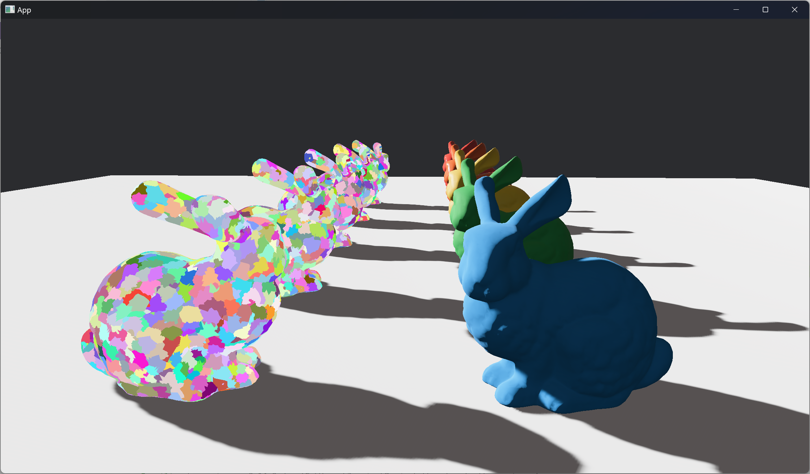

This post is going to be _very_ long, so I suggest reading over it (and the Nanite slides) a couple of times to get a general overview of the pieces involved, before spending any time analyzing individual steps. At the time of this writing, my blog theme dosen't have a table of contents sidebar that follows you as you scroll the page. I apologize for that. If you want to go back and reference previous sections as you read this post, I suggest using multiple browser tabs.

I'd also like to take a moment to thank [LVSTRI](https://github.com/LVSTRI) and [jglrxavpok](https://jglrxavpok.github.io) for sharing their experiences with virtual geometry, [atlv24](https://github.com/atlv24) for their help in several areas, especially for their work adding some missing features I needed to wgpu/naga, other Bevy developers for testing and reviewing my PRs, Unreal Engine (Brian Karis, Rune Stubbe, Graham Wihlidal) for their _excellent_ and highly detailed [SIGGRAPH presentation](https://advances.realtimerendering.com/s2021/Karis_Nanite_SIGGRAPH_Advances_2021_final.pdf), and many more people than I can name who provided advice on this project.

Code for this feature can be found [on github](https://github.com/JMS55/bevy/tree/ca2c8e63b9562f88c8cd7e1d88a17a4eea20aaf4/crates/bevy_pbr/src/meshlet).

If you're already familiar with Nanite, feel free to skip the next few sections of background info until you get to the Bevy-specific parts.

## Why Virtual Geometry?

Before talking about what virtual geometry _is_, I think it's worth looking at what problems it is trying to _solve_.

Lets go over the high level steps your typical [pre-2015 renderer](https://www.advances.realtimerendering.com/s2015/aaltonenhaar_siggraph2015_combined_final_footer_220dpi.pdf) would perform to render some basic geometry. I've omitted some steps that aren't relevant to this post such as uploading mesh and texture data, shadow map rendering, lighting, and other shading details.

First, on the CPU:
* Frustum culling of instances outside of the camera's view
* Choosing the appropriate level of detail (LOD) for each instance
* Sorting and batching instances into multiple draw lists
* Recording draw calls into command buffers for each draw list

Then, on the GPU:
* Setting up GPU state according to the command buffers
* Transforming vertices and rasterizing triangles
* Depth testing triangle fragments
* Shading visible fragments

Now lets try taking this renderer, and feeding it a dense cityscape made of 500 million triangles, and 150 thousand instances of different meshes.

It's going to be slow. Why? Lets look at some of the problems:
* Frustum culling lets us skip preparing or drawing instances that are outside the camera's frustum, but what if you have an instance that's only partially visible? The GPU still needs to transform, clip, and process all vertices in the mesh. Or, what if the entire scene is in the camera's frustum?
* If one instance is in front of another, it's a complete waste to draw an instance to the screen that will later be completely drawn over by another (overdraw).
* Sorting, batching, and encoding the command buffers for all those instances are going to be slow. Each instance likely has a different vertex and index buffer, different set of textures to bind, different shader (pipeline) for vertex and fragment processing, etc.
* The GPU will spend time spinning down and spinning back up as it switches state between each draw call.

Now, it's no longer 2015, there are a variety of techniques (some from before 2015, that I purposefully left out) to alleviate a lot of these issues. Deferred shading or a depth-only prepass means overdraw is less costly, bindless techniques and ubershaders reduce state switching, multi-draw can reduce draw count, etc.

However, there are some more subtle issues that come up:
* Storing all that mesh data in memory takes too much VRAM. Modern mid-tier desktop GPUs tend to have 8-12 GB of VRAM, which means all your mesh data and 4k textures need to be able to fit in that amount of storage.
* LODs were one of the steps that were meant to help reduce the amount of geometry you were feeding a GPU. However, they come with some downsides: 1) The transition between LODs tends to be noticable, even with a crossfade effect, 2) Artists need to spend time producing and tweaking LODs from their initial high-poly meshes, and 3) Like frustum culling, they don't help with the worst case of simply being close to a lot of high-poly geometry, unless you're willing to cap out at a lower resolution than the artist's original mesh.

There's also another issue I've saved for last. Despite all the culling and batching and LODs, we still have _too much_ geometry to draw every frame. We need a better way to deal with it than simple LODs.

## What is Virtual Geometry?

With the introduction of Unreal Engine 5 in 2021 came the introduction of a new technique called [Nanite](https://dev.epicgames.com/documentation/en-us/unreal-engine/nanite-virtualized-geometry-in-unreal-engine). Nanite is a system where you can preprocess your non-deforming opaque meshes, and at runtime be able to very efficiently render them, largely solving the above problems with draw counts, memory limits, high-poly mesh rasterization, and the deficiencies of traditional LODs.

Nanite works by first splitting your base mesh into a series of meshlets - small, independent clusters of triangles. Nanite then takes those clusters, groups clusters together, and simplifies the groups into a smaller set of _new_ clusters. By repeating this process, you get a tree of clusters where the leaves of the tree form the base mesh, and the root of the tree forms a simplified approximation of the base mesh.

Now at runtime, we don't just have to render one level (LOD) of the tree. We can choose specific clusters from different levels of the tree so that if you're close to one part of the mesh, it'll render many high resolution clusters. If you're far from a different part of the mesh, however, then that part will use a couple low resolution clusters that are cheaper to render. Unlike traditional LODs, which are all or nothing, part of the mesh can be low resolution, part of the mesh can be high resolution, and a third part can be somewhere in between - all at the time same time, all on a very granular level.

Additionally, the transitions between LODs can be virtually imperceptible and extremely smooth, without extra rendering work. Traditional LODs typically have to hide transitions with crossfaded opacity between two levels.

Combine this LOD technique with some per-cluster culling, a visibility buffer, streaming in and out of individual cluster data to prevent high memory usage, a custom rasterizer, and a whole bunch of others parts, and you end up with a renderer that _can_ deal with a scene made of 500 million triangles.

I mentioned before that meshes have to be opaque, and can't deform or animate (for the initial release of Nanite in Unreal Engine 5.0 this is true, but it's an area Unreal is working to improve). Nanite isin't perfect - there are still limitations. But the ceiling of what's feasible is a lot higher.

## Virtual Geometry in Bevy

Now that the background is out of the way, lets talk about Bevy. For Bevy 0.14, I've written an initial implementation that largely copies the basic ideas of how Nanite works, without implementing every single optimization and technique. Currently, the feature is called meshlets (likely to change to virtual_geometry or something else in the future). In a minute, I'll get into the actual frame breakdown and code for meshlets, but first lets start with the user-facing API.

Users wanting to use meshlets should compile with the `meshlet` cargo feature at runtime, and `meshlet_processor` cargo feature for preprocessing meshes (again, more on how that works later) into the special meshlet-specific format the meshlet renderer uses.

Enabling the `meshlet` feature unlocks a new module: `bevy::pbr::experimental::meshlet`.

First step, add `MeshletPlugin` to your app:

```rust
app.add_plugins(MeshletPlugin);
```

Next, preprocess your `Mesh` into a `MeshletMesh`. Currently, this needs to be done manually via  `MeshletMesh::from_mesh()` (again, you need the `meshlet_processor` feature enabled). This step is _very_ slow, and should be done once ahead of time, and then saved to an asset file. Note that there are limitations on the types of meshes and materials supported, make sure to read the docs.

I'm in the [middle of working on](https://github.com/bevyengine/bevy/pull/13431) an asset processor system to automatically convert entire glTF scenes, but it's not quite ready yet. For now, you'll have to come up with your own asset processing and management system.

Now, spawn your entities. In the same vein as `MeshMaterialBundle`, there's a `MeshletMeshMaterialBundle`, which uses a `MeshletMesh` instead of the typical `Mesh`.

```rust
commands.spawn(MaterialMeshletMeshBundle {
    meshlet_mesh: meshlet_mesh_handle.clone(),
    material: material_handle.clone(),
    transform: Transform::default().with_translation(Vec3::new(x as f32 / 2.0, 0.0, 0.3)),
    ..default()
});
```

Lastly, a note on materials. Meshlet entities use the same `Material` trait as regular mesh entities. There are 3 new methods that meshlet entities use however: `meshlet_mesh_fragment_shader`, `meshlet_mesh_prepass_fragment_shader`, and `meshlet_mesh_deferred_fragment_shader`.

Notice that there is no access to vertex shaders. Meshlet rendering uses a hardcoded vertex shader that cannot be changed.

Fragment shaders for meshlets are mostly the same as fragment shaders for regular mesh entities. The key difference is that instead of this:

```rust
@fragment
fn fragment(vertex_output: VertexOutput) -> @location(0) vec4<f32> {
    // ...
}
```

You should use this:

```rust
#import bevy_pbr::meshlet_visibility_buffer_resolve::resolve_vertex_output

@fragment
fn fragment(@builtin(position) frag_coord: vec4<f32>) -> @location(0) vec4<f32> {
    let vertex_output = resolve_vertex_output(frag_coord);
    // ...
}
```

# Mesh Conversion

We're now going to start the portion of this blog post going into how everything is implemented.

The first step, before we can render anything, is to convert all meshes to meshlet meshes. I talked about the user-facing API earlier on, but in this section we'll dive into what `MeshletMesh::from_mesh()` is doing under the hood in `from_mesh.rs`.

This section will be a bit dry, lacking commentary on why I did things, in favor of just describing the algorithm itself. The reason is that I don't have many unique insights into the conversion process. The steps taken are pretty much just copied from Nanite (except Nanite does it better). If you're interested in understanding this section in greater detail, definitely check out the original Nanite presentation.

Feel free to skip ahead to the frame breakdown section if you are more interested in the runtime portion of the renderer.

The high level steps for converting a mesh are as follows:
1. Build LOD 0 meshlets
2. For each meshlet, find the set of all edges making up the triangles within the meshlet
3. For each meshlet, find the set of connected meshlets (sharing an edge)
4. Divide meshlets into groups of roughly 4
5. For each group of meshlets, build a new list of triangles approximating the original group
6. For each simplified group, break them apart into new meshlets
7. Repeat steps 3-7 using the set of new meshlets, until we run out of meshlets to simplify

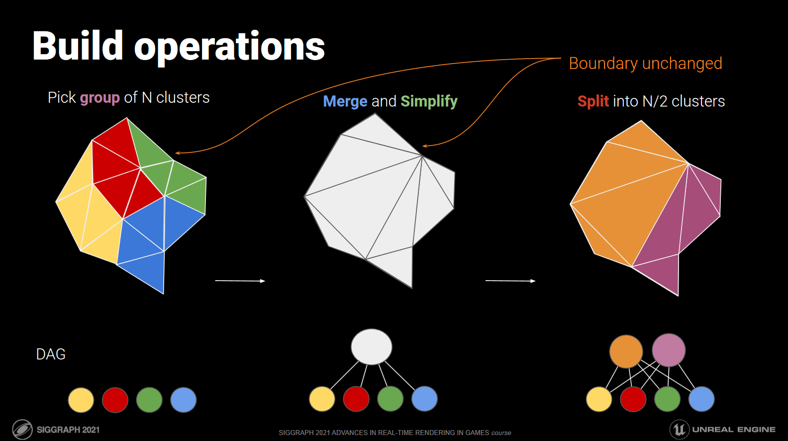

## Build LOD 0 Meshlets

We're starting with a generic triangle mesh, so the first step is to group its triangles into an initial set of meshlets. No simplification or modification of the mesh is involved - we're simply splitting up the original mesh into a set meshlets that would render exactly the same.

The crate `meshopt-rs` provides Rust bindings to the excellent `meshoptimizer` library, which provides a nice `build_meshlets()` function for us that I've wrapped into `compute_meshlets()`.

```rust
// Split the mesh into an initial list of meshlets (LOD 0)
let vertex_buffer = mesh.get_vertex_buffer_data();
let vertex_stride = mesh.get_vertex_size() as usize;
let vertices = VertexDataAdapter::new(&vertex_buffer, vertex_stride, 0).unwrap();
let mut meshlets = compute_meshlets(&indices, &vertices);
```

We also need some bounding spheres for each meshlet. The culling bounding sphere is straightforward - `compute_meshlet_bounds()`, again from `meshopt-rs`, will give us a bounding sphere encompassing the meshlet that we can use for frustum and occlusion culling later on.

The `self_lod` and `parent_lod` bounding spheres need a lot more explanation.

As we simplify each group of meshlets into new meshlets, we will deform the mesh slightly. That deformity adds up over time, eventually giving a very visibly different mesh from the original. However, when viewing the very simplified mesh from far away, due to perspective the difference will be much less noticable. While we would want to view the original (or close to the original) mesh close-up, at longer distances we can get away with rendering a much simpler version of the mesh without noticeable differences.

So, how to choose the right LOD level, or in our case, the right LOD tree cut? The LOD cut will be based on the simplification error of each meshlet along the cut, with the goal being to select a cut that is imperceptibly different from the original mesh at the distance we're viewing the mesh at.

For reasons I'll get into later during the runtime section, we're going to treat the error as a bounding sphere around the meshlet, with the radius being the error. We're also going to want two of these: one for the current meshlet itself, and one for the less-simplified group of meshlets that we simplified into the current meshlet (the current meshlet's parents in the LOD tree).

LOD 0 meshlets, being the original representation of the mesh, have no error (0.0). They also have no set of parent meshlets, which we will represent with an infinite amount of error (f32::MAX), again for reasons I will get into later.

```rust
let mut bounding_spheres = meshlets
    .iter()
    .map(|meshlet| compute_meshlet_bounds(meshlet, &vertices))
    .map(convert_meshlet_bounds)
    .map(|bounding_sphere| MeshletBoundingSpheres {
        self_culling: bounding_sphere,
        self_lod: MeshletBoundingSphere {
            center: bounding_sphere.center,
            radius: 0.0,
        },
        parent_lod: MeshletBoundingSphere {
            center: bounding_sphere.center,
            radius: f32::MAX,
        },
    })
    .collect::<Vec<_>>();
```

## Find Meshlet Edges

Now that we have our initial set of meshlets, we can start simplifying.

The first step is to find the set of triangle edges that make up each meshlet. This can be done with a simple loop over triangles, building a hashset of edges where each edge is ordered such that the smaller numbered vertex comes before the larger number vertex. This ensures that we don't accidentally add both (v1, v2) and (v2, v1), which conceptually are the same edge. Each triangle has 3 vertices and 3 edges.

```rust
let mut meshlet_triangle_edges = HashMap::new();
for i in meshlet.triangles.chunks(3) {
    let v0 = meshlet.vertices[i[0] as usize];
    let v1 = meshlet.vertices[i[1] as usize];
    let v2 = meshlet.vertices[i[2] as usize];

    meshlet_triangle_edges.insert((v0.min(v1), v0.max(v1)));
    meshlet_triangle_edges.insert((v0.min(v2), v0.max(v2)));
    meshlet_triangle_edges.insert((v1.min(v2), v1.max(v2)));
}
```

## Find Connected Meshlets

Next, we need to find the meshlets that connect to each other.

A meshlet will be considered as connected to another meshlet if both meshlets share at least one edge.

In the previous step, we built a set of edges for each meshlet. Finding if two meshlets share any edges can be done by simply taking the intersection of their two edge sets, and checking if the resulting set is not empty.

We will also store the _amount_ of shared edges between two meshlets, giving a heuristic for how "connected" each meshlet is to another. This is simply the size of the intersection set.

Overally, we will build a list per meshlet, containing tuples of (meshlet_id, shared_edge_count) for each meshlet connected to the current meshlet.

```rust
for (meshlet_id1, meshlet_id2) in simplification_queue.tuple_combinations() {
    let shared_edge_count = triangle_edges_per_meshlet[&meshlet_id1]
        .intersection(&triangle_edges_per_meshlet[&meshlet_id2])
        .count();

    if shared_edge_count != 0 {
        connected_meshlets_per_meshlet
            .get_mut(&meshlet_id1)
            .unwrap()
            .push((meshlet_id2, shared_edge_count));
        connected_meshlets_per_meshlet
            .get_mut(&meshlet_id2)
            .unwrap()
            .push((meshlet_id1, shared_edge_count));
    }
}
```

## Partition Meshlets Into Groups

Now that we know which meshlets are connected, the next step is to group them together. We're going to aim for 4 meshlets per group, although there's no way of guaranteeing that.

How should we determine which meshlets go in which group?

You can view the connected meshlet sets as a graph. Each meshlet is a node, and bidirectional edges connect one meshlet to another in the graph if we determined that they were connected earlier. The weight of each edge is the amount of shared edges between the two meshlet nodes.

Partitioning the meshlets into groups is now a matter of partitioning the graph. I use the `metis-rs` crate which provides Rust bindings to the `METIS` library. The edge weights will be used so that meshlets with a high shared edge count are more likely to be group together.

The code to format this data for metis is a bit complicated, but in the end we have a list of groups, where each group is a list of meshlets.

## Simplify Groups

Now for an important step, and the most tricky.

We take each group, and merge the triangle lists of the underlying meshlets together into one large list of triangles, forming a new mesh.

Now, we can simplify this new mesh into a lower-resolution (faster to render) version. Meshopt again provides a helpful `simplify()` function for us. Finally, less triangles to render!

In addition to the new mesh, we get an "error" value, describing how much the mesh deformed by when simplifying.

The quadratic error metric (QEM) returned from simplifying is a somewhat meaningless value, but we can use `simplify_scale()` to get an object-space value. This value is _still_ fairly meaningless, but we can treat it as the maximum amount of object-space distance a vertex was displaced by during simplification.

The error represents displacement from the meshlets we simplified, but we want the displacement from the original (LOD 0) meshlets. We can add the max error of the meshlets that went into building the current meshlet group (child nodes of the parent node that we're currently building in the LOD tree) to make the error relative to LOD 0.

If this all feels handwavy to you, that's because it is. And this is vertex positions only; we haven't even considered UV error during simplification, or how the mesh's eventual material influences perceptual differences between LOD levels. Perceptual simplification is very much an unsolved problem in computer graphics, and for now Bevy only uses positions for simplification.

You'll have to take my word for it that using the error like this works. You'll see how it gets used to pick the LOD level during runtime in a later section. For now, we'll take the group error and build a bounding sphere out of it, and assign it as the parent LOD bounding sphere for the group's (parent node, higher LOD) underlying meshlets (child nodes, lower LOD).

```rust
// Simplify the group to ~50% triangle count
let Some((simplified_group_indices, mut group_error)) =
    simplify_meshlet_groups(group_meshlets, &meshlets, &vertices, lod_level)
else {
    continue;
};

// Add the maximum child error to the parent error to make parent error cumulative from LOD 0
// (we're currently building the parent from its children)
group_error += group_meshlets.iter().fold(group_error, |acc, meshlet_id| {
    acc.max(bounding_spheres[*meshlet_id].self_lod.radius)
});

// Build a new LOD bounding sphere for the simplified group as a whole
let mut group_bounding_sphere = convert_meshlet_bounds(compute_cluster_bounds(
    &simplified_group_indices,
    &vertices,
));
group_bounding_sphere.radius = group_error;

// For each meshlet in the group set their parent LOD bounding sphere to that of the simplified group
for meshlet_id in group_meshlets {
    bounding_spheres[*meshlet_id].parent_lod = group_bounding_sphere;
}
```

## Split Groups

Finally, the last step is to take the large mesh formed from simplifying the entire meshlet group, and split it into a set of brand new meshlets.

This is in fact the same process as splitting the original mesh into meshlets.

If everything went optimally, we should have gone from the original 4 meshlets per group, to 2 new meshlets per group with 50% less triangles overall.

For each new meshlet, we'll calculate a bounding sphere for culling, assign the self_lod bounding sphere as that of the group, and the parent_lod bounding sphere again as uninitialized.

```rust
// Build new meshlets using the simplified group
let new_meshlets_count = split_simplified_groups_into_new_meshlets(
    &simplified_group_indices,
    &vertices,
    &mut meshlets,
);

// Calculate the culling bounding sphere for the new meshlets and set their LOD bounding spheres
let new_meshlet_ids = (meshlets.len() - new_meshlets_count)..meshlets.len();
bounding_spheres.extend(
    new_meshlet_ids
        .map(|meshlet_id| {
            compute_meshlet_bounds(meshlets.get(meshlet_id), &vertices)
        })
        .map(convert_meshlet_bounds)
        .map(|bounding_sphere| MeshletBoundingSpheres {
            self_culling: bounding_sphere,
            self_lod: group_bounding_sphere,
            parent_lod: MeshletBoundingSphere {
                center: group_bounding_sphere.center,
                radius: f32::MAX,
            },
        }),
);
```

We can repeat this whole process several times, ideally getting down to a single meshlet forming the root of the LOD tree. In practice, my current code can't get to that point for most meshes.

# Frame Breakdown

With the asset processing part out of the way, we can finally move onto the more interesting runtime code section.

The frame capture we'll be looking at is this scene with 3092 copies of the Stanford Bunny. Five of the bunnies are using unique PBR materials (they're hiding in the top middle), while the rest use the same debug material that visualizes the clusters/triangles of the mesh. Each bunny is made of 144,042 triangles at LOD 0, with 4936 meshlets total in the LOD tree.

GPU timings were measured on a RTX 3080 locked to base clock speeds (so not as fast as you would actually get in practice), rendering at 2240x1260, averaged over 10 frames.

> Clusters visualization
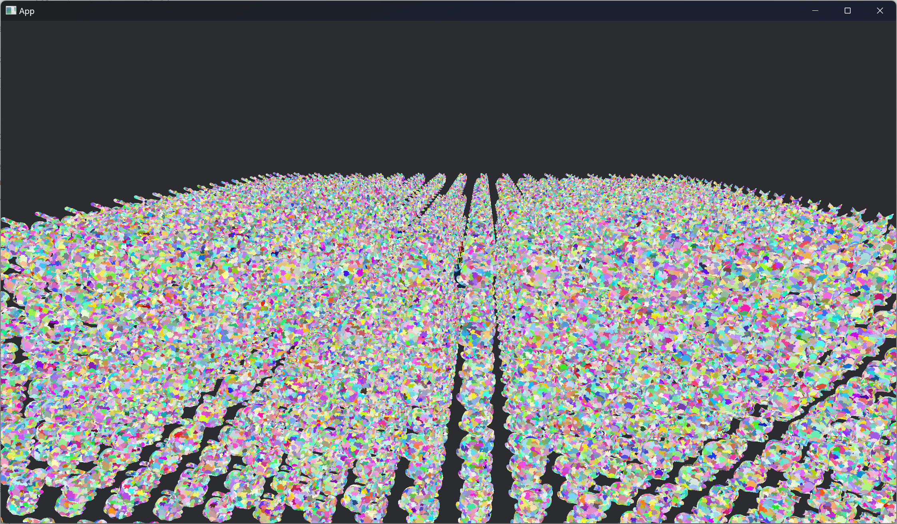
> Triangles visualization
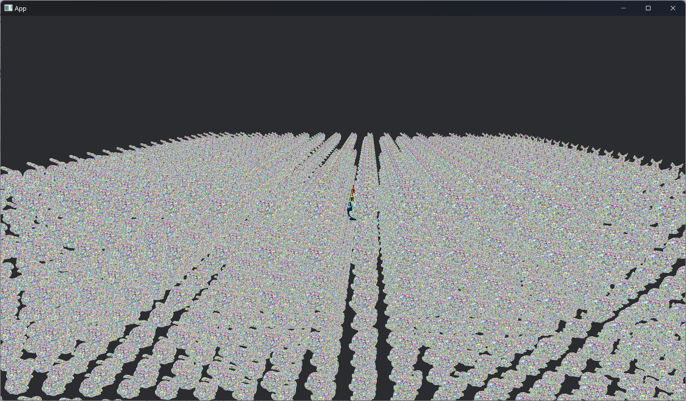

> NSight profile
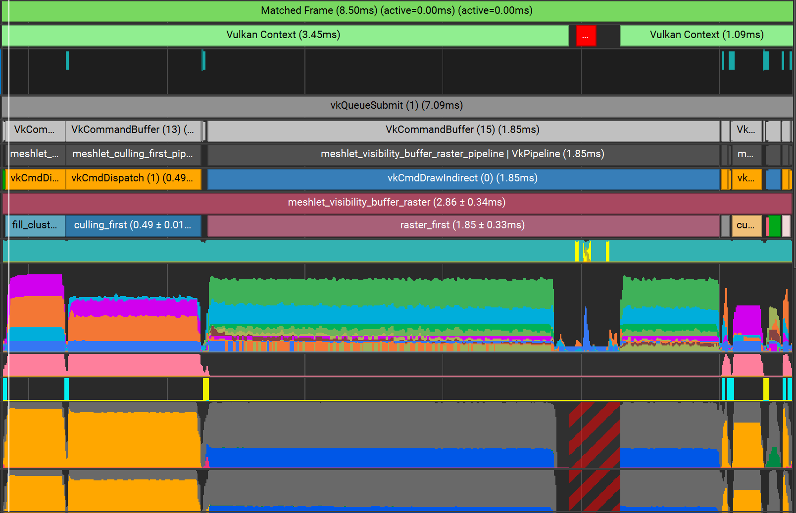

The frame can be broken down into the following passes:
1. Fill cluster buffers (0.22ms)
2. Cluster culling first pass (0.49ms)
3. Raster visbuffer first pass (1.85ms +/- 0.33ms)
4. Build depth pyramid for second pass (0.03ms)
5. Cluster culling second pass (0.11ms)
6. Raster visbuffer second pass (< 0.01ms)
7. Copy material depth (0.04ms)
8. Material shading (timings omitted as this is a poor test for materials)
9. Build depth pyramid for next frame (0.03ms)

Total GPU time is ~2.78ms +/- 0.33ms.

There's a lot to cover, so I'm going to try and keep it fairly brief in each section. The high level concepts of all of these passes (besides the first pass) are copied from Nanite, so check out their presentation for further details. I'll be trying to focus more on the lower level code and reasons why I implemented things the way I did. My first attempt at a lot of these passes had bugs, and was way slower. The details and data flow is what takes the concept from a neat tech demo, to an actually usable and scalable renderer.

## Terminology

First, some terminology:
* `asset buffers` - When a new MeshletMesh asset is loaded, we copy the buffers it's made of into large suballocated buffers. All the vertex data, meshlet data, bounding spheres, etc for multiple MeshletMesh assets are packed together into one large buffer per data type.
* `instance` - A single Bevy entity with a MeshletMesh and Material.
* `instance uniform` - A transform matrix and mesh flags for an instance.
* `material` - A combination of pipeline and bind group used for shading fragments.
* `meshlet` - A single meshlet from within a MeshletMesh asset, pointing to data within the asset buffers (more or less).
* `cluster` - A single renderable piece of an entity. Each cluster is associated with an instance and a meshlet.
    * All of our shaders will operate on clusters, and _not_ on meshlets. You can think of these like an instance of a meshlet for a specific entity, in the same way you can have an instance of a class in object-oriented programming languages.
    * Up to this point I've been using meshlet and cluster interchangeably. From now on, they have seperate, defined meanings.
* `view` - A perspective or orthographic camera with an associated depth buffer and optional color output. The main camera is a view, and additional views can be dynamically generated for e.g. rendering shadowmaps.
* `id` - A u32 index into a buffer.

## Fill Cluster Buffers

Now the first pass we're going to look at might be surprising.

Over the course of the frame, for each cluster we will need its instance (giving us a transform and material), along with its meshlet (giving us vertex data and bounding spheres).

While the cluster itself is implicit (each thread or workgroup of a shader will handle one cluster, with the global thread/workgroup ID being the cluster ID), we need some method of telling the GPU what the instance and meshlet for each cluster is.

I.e., we need an array of instance IDs and meshlet IDs such that we can do `let cluster_instance = instances[cluster_instance_ids[cluster_id]]` and `let cluster_meshlet = meshlets[cluster_meshlet_ids[cluster_id]]`.

The naive method would be to simply write out these two buffers from the CPU and transfer them to the GPU. This was how I implemented it initially, and it worked fine for my simple initial test scene with a single bunny, but I very quickly ran into performance problems when trying to scale up to rendering 3000 bunnies.

Each ID is a 4-byte u32, and it's two IDs per cluster. That's 8 bytes per cluster.

With 3092 bunnies in the scene, and 4936 meshlets per bunny, that's 8 * 3092 * 4936 bytes total = ~122.10 MBs total.

For dedicated GPUs, uploading data from the system's RAM to the GPU's VRAM is done over PCIe. PCIe x16 Gen3 max bandwidth is 16 GB/s.

Ignoring data copying costs and other overhead, and assuming max PCIe bandwidth, that would mean it would take ~7.63ms to upload cluster data. That's 7.63 / 16.6 = ~46% of our frame budget gone at 60fps, before we've even rendered anything! Obviously, we need a better method.

---

Instead of uploading per-cluster data, we're going to stick to uploading only per-instance data. Specifically, two buffers called `instance_meshlet_counts_prefix_sum` and `instance_meshlet_slice_starts`. Each buffer will be an array of integers, with an entry per instance.

The former will contain a prefix sum (calculated on the CPU while writing out the buffer) of how many meshlets each instance is made of. The latter will contain the index of where in the meshlet asset buffer each instance's list of meshlets begin.

Now we're uploading only 8 bytes per _instance_, and not per _cluster_, which is much, much cheaper. Looking back at our scene, we're uploading 3092 * 8 bytes total = ~0.025 MBs total. This is a _huge_ improvement over the ~122.10 MBs from before.

Once the GPU has this data, we can have the GPU write out the `cluster_instance_ids` and `cluster_meshlet_ids` buffers from a compute shader. Max VRAM bandwidth on my RTX 3080 is a whopping 760.3 GB/s; ~47.5x faster than the 16 GB/s of bandwidth we had over PCIe.

Each thread of the compute shader will handle one cluster, and do a binary search over the prefix sum array to find to what instance it belongs to.

Binary search might seem surprising - it's multiple dependent divergent memory accesses within a thread, and one of the biggest performance metrics for GPU code is cache efficiency. However, it's very coherent _across_ threads within the subgroup, and scales extremely well (O log n) with the number of instances in the scene. In practice, while it could be improved, the performance of this pass has not been a bottleneck.

Now that we know what instance the cluster belongs to, it's trivial to calculate the meshlet index of the cluster within the instance's meshlet mesh asset. Adding that to the instance's meshlet_slice_start using the other buffer we uploaded gives us the global meshlet index within the overall meshlet asset buffer. The thread can then write out the two calculated IDs for the cluster.

This is the only pass that runs once per-frame. The rest of the passes all run once per-view.

```rust
/// Writes out instance_id and meshlet_id to the global buffers for each cluster in the scene.

@compute
@workgroup_size(128, 1, 1) // 128 threads per workgroup, 1 cluster per thread
fn fill_cluster_buffers(
    @builtin(workgroup_id) workgroup_id: vec3<u32>,
    @builtin(num_workgroups) num_workgroups: vec3<u32>,
    @builtin(local_invocation_id) local_invocation_id: vec3<u32>
) {
    // Calculate the cluster ID for this thread
    let cluster_id = local_invocation_id.x + 128u * dot(workgroup_id, vec3(num_workgroups.x * num_workgroups.x, num_workgroups.x, 1u));
    if cluster_id >= cluster_count { return; }

    // Binary search to find the instance this cluster belongs to
    var left = 0u;
    var right = arrayLength(&meshlet_instance_meshlet_counts_prefix_sum) - 1u;
    while left <= right {
        let mid = (left + right) / 2u;
        if meshlet_instance_meshlet_counts_prefix_sum[mid] <= cluster_id {
            left = mid + 1u;
        } else {
            right = mid - 1u;
        }
    }
    let instance_id = right;

    // Find the meshlet ID for this cluster within the instance's MeshletMesh
    let meshlet_id_local = cluster_id - meshlet_instance_meshlet_counts_prefix_sum[instance_id];

    // Find the overall meshlet ID in the global meshlet buffer
    let meshlet_id = meshlet_id_local + meshlet_instance_meshlet_slice_starts[instance_id];

    // Write results to buffers
    meshlet_cluster_instance_ids[cluster_id] = instance_id;
    meshlet_cluster_meshlet_ids[cluster_id] = meshlet_id;
}
```

## Culling (First Pass)

I mentioned earlier that frustum culling is not sufficent for complex scenes. With meshlets, we're going to have a _lot_ of geometry in view at once. Rendering all of that is way too expensive, and unnecessary. It's a complete waste to spend time rendering a bunch of detailed rocks and trees, only to draw a wall in front of it later on (overdraw).

Two pass occlusion culling is the method that we're going to use to reduce overdraw. We're going to start by drawing all the clusters that actually contributed to the rendered image last frame, under the assumption that those are a good approximation of what will contribute to the rendered image _this_ frame. That's the first pass. Then, we can build a depth pyramid, and use that to cull all the clusters that we didn't look at in the first pass, i.e. that didn't render last frame. The clusters that survive the culling get drawn. That's the second pass.

In the example with the wall with the rocks and trees behind it, we could see that last frame the wall clusters contributed pixels to the final image, but none of the rock or tree clusters did. Therefore in the first pass, we would draw only the wall, and then build a depth pyramid from the resulting depth. In the second pass, we would test the remaining clusters (all the trees and rocks) against the depth pyramid, and see that they would still be occluded by the wall, and therefore we can skip drawing them. If there were some new rocks that came into view as we peeked around the corner, they'd be drawn here. The second pass functions as a cleanup pass, for rendering the objects that we missed in the first pass.

Done correctly, two pass occlusion culling reduces the amount of clusters we draw in an average frame, saving rendering time without any visible artifacts.

### Initial Cluster Processing

Before we start looking at the algorithm steps and code, I'd like to note that this shader is very performance and bug sensitive. I've written and rewritten it several times. While the concepts are simple, it's easy to break the culling, and the choices in data management that we make here affect the rest of the rendering pipeline quite significantly.

This is going to be a long and complicated shader, so let's dive into it.

The first pass of occlusion culling is another compute shader dispatch with one thread per cluster. A minor detail that I didn't mention last time we saw this pattern, is that with millions of clusters in a scene, you would quickly hit the limit of the maximum number of workgroups you can spawn per dispatch dimension if you did a 1d dispatch over all clusters. To work around this, we instead we do a 3d dispatch with each dimension of size `ceil(cbrt(workgroup_count))`. We can then swizzle the workgroup and thread indices back to 1d in the shader.

```rust
@compute
@workgroup_size(128, 1, 1) // 128 threads per workgroup, 1 cluster per thread
fn cull_meshlets(
    @builtin(workgroup_id) workgroup_id: vec3<u32>,
    @builtin(num_workgroups) num_workgroups: vec3<u32>,
    @builtin(local_invocation_id) local_invocation_id: vec3<u32>,
) {
// Calculate the cluster ID for this thread
let cluster_id = local_invocation_id.x + 128u * dot(workgroup_id, vec3(num_workgroups.x * num_workgroups.x, num_workgroups.x, 1u));
if cluster_id >= arrayLength(&meshlet_cluster_meshlet_ids) { return; }
```

Once we know what cluster this thread should process, the next step is to check instance culling. Bevy has the concept of render layers, where certain entities only render for certain views. Before rendering, we uploaded a bitmask of whether each instance was visible for the current view or not. In the shader, we'll just check that bitmask, and early-out if the cluster belongs to an instance that should be culled.

The instance ID can be found via indexing into the per-cluster data buffer that we computed in the previous pass (fill cluster buffers).

```rust
// Check for instance culling
let instance_id = meshlet_cluster_instance_ids[cluster_id];
let bit_offset = instance_id % 32u;
let packed_visibility = meshlet_view_instance_visibility[instance_id / 32u];
let should_cull_instance = bool(extractBits(packed_visibility, bit_offset, 1u));
if should_cull_instance { return; }
```

Assuming the cluster's instance was not culled, we can now start fetching the rest of the cluster's data for culling. The instance ID we found also gives us access to the instance uniform, and we can fetch the meshlet ID the same way we did the instance ID. With these two indices, we can also fetch the culling bounding sphere for the cluster's meshlet, and convert it from local to world-space.

```rust
// Calculate world-space culling bounding sphere for the cluster
let instance_uniform = meshlet_instance_uniforms[instance_id];
let meshlet_id = meshlet_cluster_meshlet_ids[cluster_id];
let world_from_local = affine3_to_square(instance_uniform.world_from_local);
let world_scale = max(length(world_from_local[0]), max(length(world_from_local[1]), length(world_from_local[2])));
let bounding_spheres = meshlet_bounding_spheres[meshlet_id];
var culling_bounding_sphere_center = world_from_local * vec4(bounding_spheres.self_culling.center, 1.0);
var culling_bounding_sphere_radius = world_scale * bounding_spheres.self_culling.radius;
```

A simple frustum test lets us cull out of view clusters (an early return means the cluster is culled).

```rust
// Frustum culling
for (var i = 0u; i < 6u; i++) {
    if dot(view.frustum[i], culling_bounding_sphere_center) + culling_bounding_sphere_radius <= 0.0 {
        return;
    }
}
```

### LOD Selection

Now that we know if a cluster is in view, the next question we need to ask is "Is this cluster's meshlet part of the right cut of the LOD tree?"

The goal is to select the set of simplified meshlets such that at the distance we're viewing them from, they have less than 1 pixel of geometric difference from the original set of meshlets at LOD 0 (the base mesh). Note that we're accounting _only_ for geometric differences, and not taking into account material or lighting differences. Doing so is a _much_ harder problem.

So, the question is then "how do we determine if the group this meshlet belongs to has less than 1 pixel of geometric error?"

When building the meshlet groups during asset preprocessing, we stored the group error relative to the base mesh as the radius of the bounding sphere. We can convert this bounding sphere from local to world-space, project it to view-space, and then check how many pixels on the screen it takes up. If it's less than 1 pixel, then the cluster is imperceptibly different. We're essentially answering the question "if the mesh deformed by X meters, how many pixels of change is that when viewed from the current camera"?

```rust
// https://stackoverflow.com/questions/21648630/radius-of-projected-sphere-in-screen-space/21649403#21649403
fn lod_error_is_imperceptible(sphere_center: vec3<f32>, sphere_radius: f32) -> bool {
    let d2 = dot(sphere_center, sphere_center);
    let r2 = sphere_radius * sphere_radius;
    let sphere_diameter_uv = view.clip_from_view[0][0] * sphere_radius / sqrt(d2 - r2);
    let view_size = f32(max(view.width, view.height));
    let sphere_diameter_pixels = sphere_diameter_uv * view_size;
    return sphere_diameter_pixels < 1.0;
}
```

Knowing if the cluster has imperceptible error is not sufficent by itself. Say you have 4 sets of meshlets - the original one (group 0), and 3 progressively simplified versions (groups 1-3). If group 2 has imperceptible error for the current view, then so would groups 1 and 0. In fact, group 0 will _always_ have imperceptible error, given that it _is_ the base mesh.

Given multiple sets of imperceptibly different meshlets, the best set to select is the one made of the fewest triangles (most simplified), which is the highest LOD.

Since we're processing each cluster in parallel, we can't communicate between them to choose the correct LOD cut. Instead, we can use a neat trick. We can design a procedure where each cluster evaluates some data, and decides independently whether it's at the correct LOD, in a way that's consistent across all the clusters.

The Nanite slides go into the theory more, but it boils down to checking if error is imperceptible for the current cluster, _and_ that its _parent's_ error is _not_ imperceptible. I.e. this is the most simple cluster we can choose with imperceptible error, and going up to it's even more simple parent would cause visible error.

We can take the two LOD bounding spheres (the ones containing simplification error) for each meshlet, transform them to view-space, check if the error for each one is imperceptible or not, and then early-out if this cluster is not part of the correct LOD cut.

```rust
// Calculate view-space LOD bounding sphere for the meshlet
let lod_bounding_sphere_center = world_from_local * vec4(bounding_spheres.self_lod.center, 1.0);
let lod_bounding_sphere_radius = world_scale * bounding_spheres.self_lod.radius;
let lod_bounding_sphere_center_view_space = (view.view_from_world * vec4(lod_bounding_sphere_center.xyz, 1.0)).xyz;

// Calculate view-space LOD bounding sphere for the meshlet's parent
let parent_lod_bounding_sphere_center = world_from_local * vec4(bounding_spheres.parent_lod.center, 1.0);
let parent_lod_bounding_sphere_radius = world_scale * bounding_spheres.parent_lod.radius;
let parent_lod_bounding_sphere_center_view_space = (view.view_from_world * vec4(parent_lod_bounding_sphere_center.xyz, 1.0)).xyz;

// Check LOD cut (meshlet error imperceptible, and parent error not imperceptible)
let lod_is_ok = lod_error_is_imperceptible(lod_bounding_sphere_center_view_space, lod_bounding_sphere_radius);
let parent_lod_is_ok = lod_error_is_imperceptible(parent_lod_bounding_sphere_center_view_space, parent_lod_bounding_sphere_radius);
if !lod_is_ok || parent_lod_is_ok { return; }
```

### Occlusion Culling Test

We've checked if the cluster is in view (frustum and render layer culling), as well as if it's part of the correct LOD cut. It's now time for the actual occlusion culling part of the first of the two passes for two pass occlusion culling.

Our goal in the first pass is to render only clusters that were visible last frame. One possible method would be to store another bitmask of whether each cluster was visible in the current frame, and read from it in the next frame. The problem with this is that it uses a good chunk of memory, and more importantly, does not play well with LODs. Before I implemented LODs I used this method, but with LODs, a cluster that was visible last frame might not be part of the LOD cut in this frame and therefore incorrect to render.

Instead of explicitly storing whether a cluster is visible, we're instead going to occlusion cull the clusters against the depth pyramid from the _previous_ frame. We can take the culling bounding sphere of the cluster, project it to view-space using the previous frame's set of transforms, and then project it to a screen-space axis-aligned bounding box (AABB). We can then compare the view-space depth of the bounding sphere's extents with every pixel of the depth buffer that the AABB we calculated covers. If all depth pixels show that there is geometry in front of the bounding sphere, then the mesh was not visible last frame, and therefore should not be rendered in the first occlusion culling pass.

Of course sampling every pixel an AABB covers would be extremely expensive, and cache inefficient. Instead we'll use a depth _pyramid_, which is a mipmapped version of the depth buffer. Each pixel in MIP 1 corresponds to the min of 4 pixels from MIP 0, each pixel in MIP 2 corresponds to the min of 4 pixels from MIP 1, etc down to a 1x1 layer. Now we only have to sample 4 pixels for each AABB, choosing the mip level that best fits the AABB onto a 2x2 quad. Don't worry about how we generate the depth pyramid for now, we'll talk about that more later.

If any of that was confusing, read up on occlusion culling and depth pyramids. The important takeaway is that we're using the previous frame's depth pyramid in the first occlusion culling pass to find which clusters would have been visible last frame.

```rust
// Project the culling bounding sphere to view-space for occlusion culling
let previous_world_from_local = affine3_to_square(instance_uniform.previous_world_from_local);
let previous_world_from_local_scale = max(length(previous_world_from_local[0]), max(length(previous_world_from_local[1]), length(previous_world_from_local[2])));
culling_bounding_sphere_center = previous_world_from_local * vec4(bounding_spheres.self_culling.center, 1.0);
culling_bounding_sphere_radius = previous_world_from_local_scale * bounding_spheres.self_culling.radius;
let culling_bounding_sphere_center_view_space = (view.view_from_world * vec4(culling_bounding_sphere_center.xyz, 1.0)).xyz;

let aabb = project_view_space_sphere_to_screen_space_aabb(culling_bounding_sphere_center_view_space, culling_bounding_sphere_radius);
// Halve the view-space AABB size as the depth pyramid is half the view size
let depth_pyramid_size_mip_0 = vec2<f32>(textureDimensions(depth_pyramid, 0)) * 0.5;
let width = (aabb.z - aabb.x) * depth_pyramid_size_mip_0.x;
let height = (aabb.w - aabb.y) * depth_pyramid_size_mip_0.y;
// Note: I've seen people use floor instead of ceil here, but it seems to result in culling bugs.
//       The max(0, x) is also important to prevent out of bounds accesses.
let depth_level = max(0, u32(ceil(log2(max(width, height)))));
let depth_pyramid_size = vec2<f32>(textureDimensions(depth_pyramid, depth_level));
let aabb_top_left = vec2<u32>(aabb.xy * depth_pyramid_size);

// Note: I'd use a min sampler reduction here if it were available in wgpu.
//       textureGather() can't be used either, as it dosen't let you specify a mip level.
let depth_quad_a = textureLoad(depth_pyramid, aabb_top_left, depth_level).x;
let depth_quad_b = textureLoad(depth_pyramid, aabb_top_left + vec2(1u, 0u), depth_level).x;
let depth_quad_c = textureLoad(depth_pyramid, aabb_top_left + vec2(0u, 1u), depth_level).x;
let depth_quad_d = textureLoad(depth_pyramid, aabb_top_left + vec2(1u, 1u), depth_level).x;
let occluder_depth = min(min(depth_quad_a, depth_quad_b), min(depth_quad_c, depth_quad_d));

// Check whether or not the cluster would be occluded if drawn
var cluster_visible: bool;
if view.clip_from_view[3][3] == 1.0 {
    // Orthographic
    let sphere_depth = view.clip_from_view[3][2] + (culling_bounding_sphere_center_view_space.z + culling_bounding_sphere_radius) * view.clip_from_view[2][2];
    cluster_visible = sphere_depth >= occluder_depth;
} else {
    // Perspective
    let sphere_depth = -view.clip_from_view[3][2] / (culling_bounding_sphere_center_view_space.z + culling_bounding_sphere_radius);
    cluster_visible = sphere_depth >= occluder_depth;
}
```

### Result Writeout

We're finally at the last step of the first occlusion culling pass/dispatch. As a reminder, everything from after the fill cluster buffers step until the end of this section has all been one shader. I warned you it would be long!

The last step for this pass is to write out the results of what clusters should render. This pass is just a compute shader - it dosen't actually render anything. We're just going to fill out the arguments for a single indirect draw command (more on this in the next pass).

First, before we get to the indirect draw, we need to write out another piece of data. The second occlusion culling pass later will want to operate only on clusters in view, that passed the LOD test, and that were _not_ drawn in the first pass. That means we didn't early return during the frustum culling or LOD test, and that cluster_visible was false from the occlusion culling test.

In order for the second occlusion pass to know which clusters satisfy these conditions, we'll write out another bitmask of 1 bit per cluster, with clusters that the second occlusion pass should operate on having their bit set to 1. An atomicOr takes care of setting each cluster's bit in parallel amongst all threads.

```rust
// Write if the cluster should be occlusion tested in the second pass
if !cluster_visible {
    let bit = 1u << cluster_id % 32u;
    atomicOr(&meshlet_second_pass_candidates[cluster_id / 32u], bit);
}
```

Now we have the final step of filling out the indirect draw data for the clusters that we _do_ want to draw in the first pass.

We can do an atomicAdd on the DrawIndirectArgs::vertex_count with the meshlet's vertex count (triangle count * 3). This does two things:
1. Adds more vertex invocations to the indirect draw for this cluster's triangles
2. Reserves space in a large buffer for all of this cluster's triangles to write out a per-triangle number

With the draw_triangle_buffer space reserved, we can then fill it with an encoded u32 integer: 26 bits for the cluster ID, and 6 bits for the triangle ID within the cluster's meshlet. 6 bits gives us 2^6 = 64 possible values, which is perfect as when we were building meshlets during asset preprocessing, we limited each meshlet to max 64 vertices and 64 triangles.

During vertex shading in the next pass, each vertex invocation will be able to use this buffer to know what triangle and cluster it belongs to.

```rust
// Append a list of this cluster's triangles to draw if not culled
if cluster_visible {
    let meshlet_triangle_count = meshlets[meshlet_id].triangle_count;
    let buffer_start = atomicAdd(&draw_indirect_args.vertex_count, meshlet_triangle_count * 3u) / 3u;

    let cluster_id_packed = cluster_id << 6u;
    for (var triangle_id = 0u; triangle_id < meshlet_triangle_count; triangle_id++) {
        draw_triangle_buffer[buffer_start + triangle_id] = cluster_id_packed | triangle_id;
    }
}
```

## Raster (First Pass)

We've now determined what to draw, so it's time to draw it.

As I mentioned in the previous section, we're doing a single draw_indirect() call to rasterize every single cluster at once, using the DrawIndirectArgs buffer we filled out in the previous pass.

We're going to render to a few different render targets:
* Depth buffer
* Visibility buffer (optional, not rendered for shadow map views)
* Material depth (optional, not rendered for shadow map views)

The depth buffer is straightforward. The visibility buffer is a R32Uint texture storing the cluster ID + triangle ID packed together in the same way as during the culling pass. Material depth is a R16Uint texture storing the material ID. The visibility buffer and material depth textures will be used in a later pass for shading.

Note that it would be better to skip writing material depth here, and write it out as part of the later copy material depth pass. This pass is going to change in the near future when I add software rasterization however (more on this in a second), so for now I've left it as-is.

I won't show the entire shader, but getting the triangle data to render for each vertex is fairly straightforward. The vertex invocation index can be used to index into the draw_triangle_buffer that we wrote out during the culling pass, giving us a packed cluster ID and triangle ID. The vertex invocation index % 3 gives us which vertex within the triangle this is, and then we can lookup the cluster's meshlet and instance data as normal. Vertex data can be obtained by following the tree of indices using the index ID and meshlet info.

```rust
@vertex
fn vertex(@builtin(vertex_index) vertex_index: u32) -> VertexOutput {
    let packed_ids = draw_triangle_buffer[vertex_index / 3u];

    let cluster_id = packed_ids >> 6u;
    let meshlet_id = meshlet_cluster_meshlet_ids[cluster_id];
    let meshlet = meshlets[meshlet_id];

    let triangle_id = extractBits(packed_ids, 0u, 6u);
    let index_id = (triangle_id * 3u) + (vertex_index % 3u);
    let index = get_meshlet_index(meshlet.start_index_id + index_id);
    let vertex_id = meshlet_vertex_ids[meshlet.start_vertex_id + index];
    let vertex = unpack_meshlet_vertex(meshlet_vertex_data[vertex_id]);

    let instance_id = meshlet_cluster_instance_ids[cluster_id];
    let instance_uniform = meshlet_instance_uniforms[instance_id];

    // ...
}
```

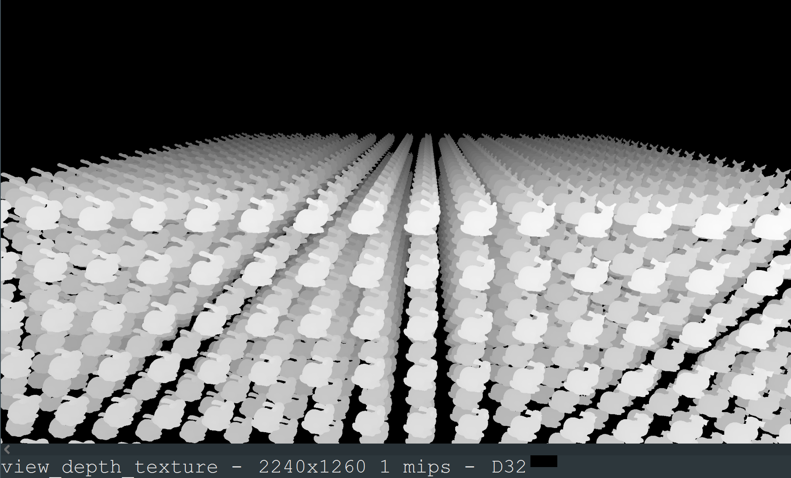
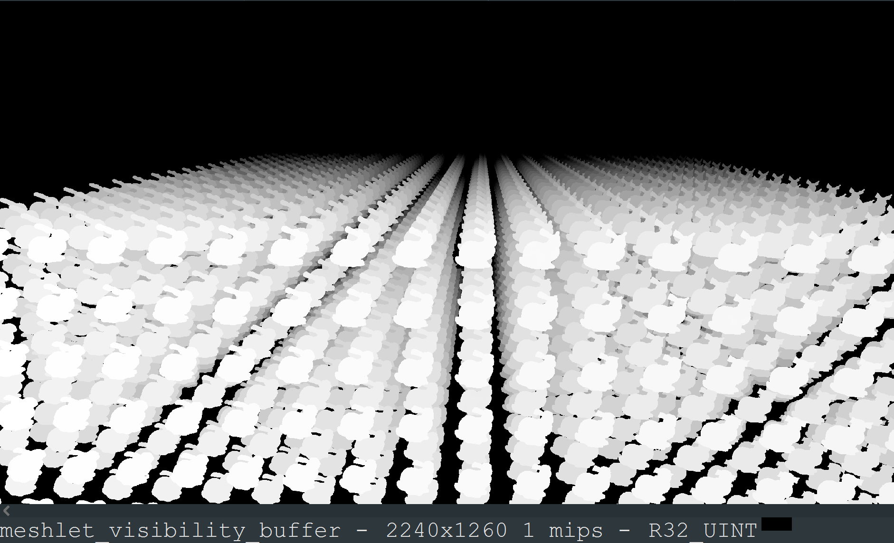
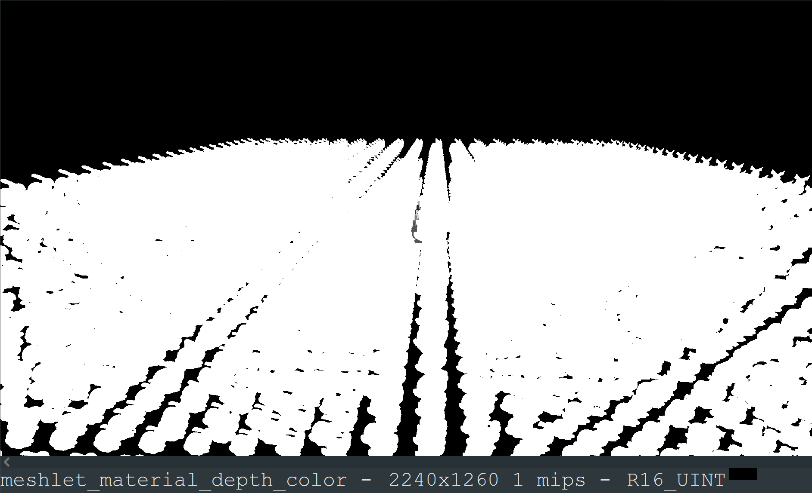

> Quad overdraw from Renderdoc
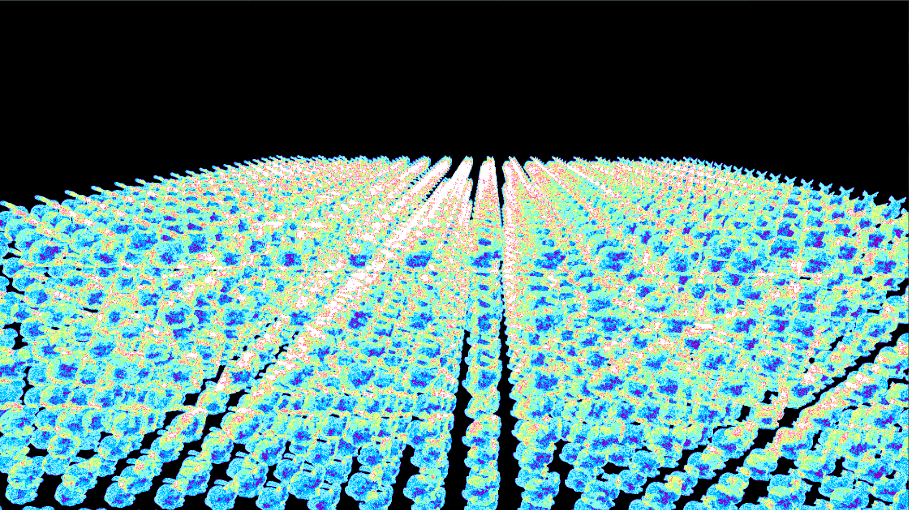
> Triangle size from Renderdoc
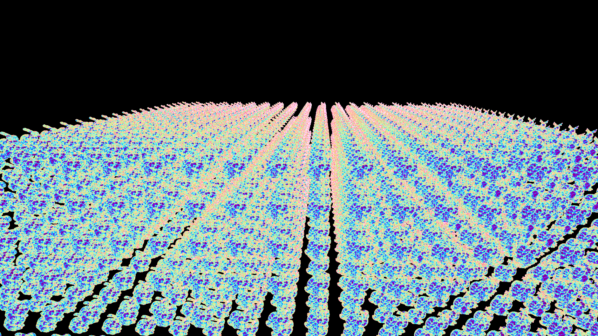

---

With the overview out of the way, the real topic to discuss for this pass is "why a single draw indirect?" There are several other possibilities I could have gone with:
* Mesh shaders
* Single draw indexed indirect after writing out an index buffer during the culling pass
* Single draw indirect, with a cluster ID buffer, snapping extra vertex invocations to NaN
* Multi draw indirect with a sub-draw per cluster
* Multi draw indirect with a sub-draw per meshlet triangle count bin
* Software rasterization

Mesh shaders are sadly not supported by wgpu, so that's out. They would be the best option for taking advantage of GPU hardware.

Single draw indexed indirect was what I originally used. It's about 10-20% faster (if I remember correctly, it's been a while) than the non-indexed variant I use now. However, that means we would need to allocate an index buffer for our worst case usage at 12 bytes/triangle. That's extremely expensive for the amount of geometry we want to deal with, and you'd quickly run into buffer size limits (~2gb on most platforms). You could dynamically allocate a new buffer size based on amount of rendered triangles after culling with some CPU readback and some heuristics, but that's more complicated and still very memory hungry. Single draw indirect with the 4 bytes/triangle draw_triangle_buffer that I ended up using is still expensive, but good enough to scrape by for now.

Single draw indirect with a buffer of cluster IDs is also an option. Each meshlet has max 64 triangles, so we could spawn cluster_count * 64 * 3 vertex invocations. Vertex invocation index / (64 * 3) would give you an index into the cluster ID buffer, and triangle ID is easy to recover via some simple arithmetic. At 4 bytes/cluster, this option is _much_ cheaper in memory than any of the previous methods. The problem is how to handle excess vertex invocations. Not all meshlets will have a full 64 triangles. It's easy enough to have each vertex invocation check the meshlet's triangle count, and if it's not needed, write out a NaN position, causing the GPU to ignore the triangle. The problem is that this performed very poorly when I tested it. All those dummy NaN triangles took up valuable fixed-function time that the GPU could have spent processing other triangles. Maybe performance would be better if I were able to get meshlets much closer to the max triangle count, or halving the max triangle count to 32 per meshlet to spawn less dummy triangles, but I ended up not pursuing this method.

Multi draw is also an option. We could write out a buffer with 1 DrawIndirectArgs per cluster, giving 16 bytes/cluster. Each sub-draw would contain exactly the right amount of vertex invocations per cluster. Each vertex invocation would be able to recover their cluster ID via the instance_id builtin, as we would set DrawIndirectArgs::first_instance to the cluster ID. On the CPU, this would still be a single draw call. In practice, I found this still performed poorly. While we are no longer bottlenecked by the GPU having to process dummy triangles, now the GPU's command processor has to process all these sub-commands. At 1 sub-command per cluster, that's a _lot_ of commands. Like the fixed 64 vertex invocations per cluster path, we're again bottlenecked on something that isin't actual rasterization work.

An additional idea I thought of while writing this section is to bin each cluster by its meshlet triangle count. All clusters whose meshlets have 10 triangles would go in one bin, 12 triangles in a second bin, 46 triangles in a third bin, etc, for 63 bins total (we would never have a meshlet with 0 triangles). We could then write out a DrawIndirectArgs and list of cluster IDs per bin, and do a single multi_draw_indirect() call on the CPU, similiar to the last section. I haven't tested it out, but this seems like a decent option in theory. I believe Nanite does something similiar in recent versions of Unreal Engine 5 in order to support different types of vertex shaders.

Finally, we could use software rasterization. We could write out a list of cluster IDs, spawn 1 workgroup per cluster, and have each workgroup manually rasterize the cluster via some linear algebra, bypassing fixed-function GPU hardware entirely. This is what Nanite does for over 90% of their clusters. Only large clusters and clusters needing depth clipping are rendered via hardware draws. Not only is this one of the most memory efficent options, it's faster than hardware draws for the majority of clusters (hence why Nanite uses it so heavily). Unfortunately, wgpu once again lacks support for a needed feature, this time 64bit texture atomics. The good news is that @atlv24 is working on adding support for this feature, and I'm looking forward to implementing software rendering in a future release of Bevy.

## Downsample Depth

With the first of the two passes of two pass occlusion culling rendered, it's time to prepare for the second pass. Namely, we need to generate a new depth pyramid based on the depth buffer we just rendered.

For generating the depth pyramid, I ported the FidelityFX Single Pass Downsampler (SPD) to Bevy. SPD lets us perform the downsampling very efficiently, entirely in a single compute dispatch. You could use multiple raster passes, but that's extremely expensive in both CPU time (command recording and wgpu resource tracking), and GPU time (bandwidth reading/writing between passes, pipeline bubbles as the GPU spins up and down between passes).

For now, we're actually using two compute dispatches, not one. Wgpu lacks support for globallycoherent buffers, so we have to split the dispatch in two to ensure writes made by the first are visible to the second. I also did not implement the subgroup version of SPD, as wgpu lacked support at the time (it has it now, minus quad operations, which SPD does need). Still very fast despite these small deficiencies.

One important note is that we need to ensure that the depth pyramid is conservative. For non-power-of-two depth textures, for instance, we might need special handling of the downsampling. Same for when we sample the depth pyramid during occlusion culling. I haven't done anything special to handle this, but it seems to work well enough. I'm not entirely confident in the edge cases here though.

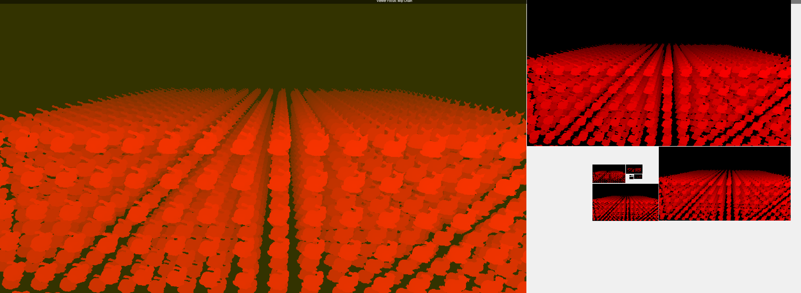

## Culling (Second Pass)

The second culling pass is where we decide whether to render the rest of the clusters - the ones that we didn't think were a good set of occluders for the scene, and decided to hold off on rendering.

This culling pass is much the same as the first, with a few key differences:
* We skip frustum and LOD culling, as we did it the first time
* We operate only on the clusters that we explicitly marked as second pass candidates during the first culling pass
  * We're still doing a large 3d dispatch over all clusters in the scene, but we can early-out for the clusters that are not second pass candidates
* We use the current transforms for occlusion culling, instead of last frame's
* We occlusion cull using the depth pyramid generated from the previous pass

By doing this, we can skip drawing any clusters that would be occluded by the existing geometry that we rendered in the first pass.

As a result of this pass, we have another DrawIndirectArgs we can use to draw the remaining clusters.

## Raster (Second Pass)

This pass is identical to the first raster pass, just with the new set of clusters from the second culling pass.

Given that the camera and scene is static in the example fram that we're looking at, the first pass perefectly calculated occlusion, and there is nothing to actually render in this pass.

## Copy Material Depth

For reasons we'll get to in the material shading pass, we need to copy the R16Uint material depth texture we rasterized earlier to an actual Depth16Unorm depth texture. A simple fullscreen triangle pass with a sample and a divide performs the copy.

I mentioned earlier that ideally we wouldn't write out the material depth during the rasterization pass. It would be better to instead write it out during this pass, by sampling the visibility buffer, looking up the material ID from the cluster ID, and then writing it out to the depth texture directly. I intend to switch to this method in the near future.

```rust
#import bevy_core_pipeline::fullscreen_vertex_shader::FullscreenVertexOutput

@group(0) @binding(0) var material_depth: texture_2d<u32>;

/// This pass copies the R16Uint material depth texture to an actual Depth16Unorm depth texture.

@fragment
fn copy_material_depth(in: FullscreenVertexOutput) -> @builtin(frag_depth) f32 {
    return f32(textureLoad(material_depth, vec2<i32>(in.position.xy), 0).r) / 65535.0;
}
```

## Material Shading

At this point we have the visibility buffer texture containing packed cluster and triangle IDs per pixel, and the material depth texture containing the material ID as a floating point depth value.

Now, it's time to apply materials to the frame in a set of "material shading" draws. Note that we're not necessarily rendering a lit and shaded scene. The meshlet feature works with all of Bevy's existing rendering modes (forward, forward + prepass, and deferred). For instance, we could be rendering a GBuffer here, or a normal and motion vector prepass.

### Vertex Shader

For each material, we will perform one draw call of a fullscreen triangle.

```rust
// 1 fullscreen triangle draw per material
for (material_id, material_pipeline_id, material_bind_group) in meshlet_view_materials.iter() {
    if meshlet_gpu_scene.material_present_in_scene(material_id) {
        if let Some(material_pipeline) = pipeline_cache.get_render_pipeline(*material_pipeline_id) {
            let x = *material_id * 3;
            render_pass.set_render_pipeline(material_pipeline);
            render_pass.set_bind_group(2, material_bind_group, &[]);
            render_pass.draw(x..(x + 3), 0..1);
        }
    }
}
```

Note that we're not drawing the typical 0..3 vertices for a fullscreen triangle. Instead, we're drawing 0..3 for the first material, 3..6 for the second material, 6..9 for the third material, etc.

In the vertex shader (which is hardcoded for all materials), we can derive the material_id of the draw from the vertex index, and then use that to set the depth of the triangle.

```rust
@vertex
fn vertex(@builtin(vertex_index) vertex_input: u32) -> @builtin(position) vec4<f32> {
    let vertex_index = vertex_input % 3u;
    let material_id = vertex_input / 3u;

    let material_depth = f32(material_id) / 65535.0;
    let uv = vec2<f32>(vec2(vertex_index >> 1u, vertex_index & 1u)) * 2.0;

    return vec4(uv_to_ndc(uv), material_depth, 1.0);
}
```

The material's pipeline depth comparison function will be set to equals, so we only shade fragments for which the depth of the triangle is equal to the depth in the depth buffer. The depth buffer attached here is the material depth texture we rendered earlier. Thus, each fullscreen triangle draw per material will only shade the fragments for that material.

Note that this is pretty inefficent if you have many materials. Each fullscreen triangle will cost an entire screen's worth of depth comparisons. In the future I'd like to switch to compute-shader based material shading.

### Fragment Shader

Now that we've determined what fragments to shade, it's time to apply the material's shader code to those fragments. Each fragment can sample the visibility buffer, recovering the cluster ID and triangle ID. Like before, this provides us access to the rest of the instance and mesh data.

The remaining tricky bit is that since we're not actually rendering a mesh in the draw call, and are using a single triangle just to cover some fragments to shade, we don't have automatic interpolation of vertex attributes within a mesh triangle or screen-space derivatives for mipmapped texture sampling.

To compute this data ourselves, each fragment can load all 3 vertices of its mesh triangle, and compute the barycentrics and derivatives manually. Big thanks to The Forge for this code.

In Bevy, all the visibility buffer loading, data loading and unpacking, vertex interpolation calculations, etc is wrapped up in the `resolve_vertex_output()` function for ease of use.

```rust
/// Load the visibility buffer texture and resolve it into a VertexOutput.
fn resolve_vertex_output(frag_coord: vec4<f32>) -> VertexOutput {
    let packed_ids = textureLoad(meshlet_visibility_buffer, vec2<i32>(frag_coord.xy), 0).r;
    let cluster_id = packed_ids >> 6u;
    let meshlet_id = meshlet_cluster_meshlet_ids[cluster_id];
    let meshlet = meshlets[meshlet_id];
    let triangle_id = extractBits(packed_ids, 0u, 6u);

    // ...

    // https://github.com/ConfettiFX/The-Forge/blob/2d453f376ef278f66f97cbaf36c0d12e4361e275/Examples_3/Visibility_Buffer/src/Shaders/FSL/visibilityBuffer_shade.frag.fsl#L83-L139
    let partial_derivatives = compute_partial_derivatives(
        array(clip_position_1, clip_position_2, clip_position_3),
        frag_coord_ndc,
        view.viewport.zw,
    );

    // ...

    let world_position = mat3x4(world_position_1, world_position_2, world_position_3) * partial_derivatives.barycentrics;
    let uv = mat3x2(vertex_1.uv, vertex_2.uv, vertex_3.uv) * partial_derivatives.barycentrics;

    let ddx_uv = mat3x2(vertex_1.uv, vertex_2.uv, vertex_3.uv) * partial_derivatives.ddx;
    let ddy_uv = mat3x2(vertex_1.uv, vertex_2.uv, vertex_3.uv) * partial_derivatives.ddy;

    // ...
}
```

## Downsample Depth (Again)

Lastly, for next frame's first culling pass, we're going to need the previous frame's depth pyramid. This is where we'll generate it. We'll use the same exact process that we used for the first depth downsample, but this time we'll use the depth buffer generated as a result of the second raster pass, instead of the first.

# Future Work

And with that we're done with the frame breakdown. I've covered all the major steps and shaders of how virtual geometry will work in Bevy 0.14. I did skip some of the CPU-side data management, but it's fairly boring and subject to a rewrite soon anyways.

However, Bevy 0.14 is just the start. There's tons of improvements I'm hoping to implement in a future version, such as:
* Major improvements to the rasterization passes via software rasterization, and trying out my multi draw with bins idea for hardware raster
* Copying Nanite's idea of culling and LOD selection via persistent threads. This should let us eliminate the separate fill_cluster_buffers step, speedup culling, and remove the need for large 3d dispatches over all clusters in the scene
* Compressing asset vertex data by using screen-derived tangents and octahedral-encoded normals, and possibly position/UV quantization
* Performance, quality, reliability, and workflow improvements for the mesh to meshlet mesh asset preprocessing
* Compute-based material shading passes instead of the fullscreen triangle method, and possibly software variable rate shading, inspired by Unreal Engine 5.4's [GPU-driven Nanite materials](https://www.unrealengine.com/en-US/blog/take-a-deep-dive-into-nanite-gpu-driven-materials) and [this set of blog posts](http://filmicworlds.com/blog/visibility-buffer-rendering-with-material-graphs) from John Hable
* Streaming in and out asset data from/to disk instead of keeping all of it in memory all the time

With any luck, and a lot of hard work, I'll be back for another blog post about all these changes in the future. Until then, enjoy Bevy 0.14!
