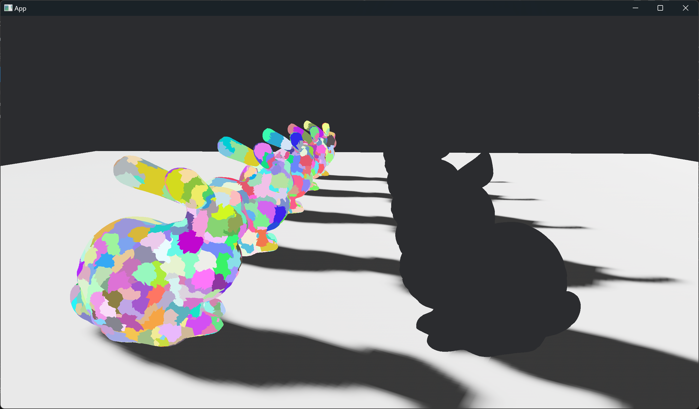
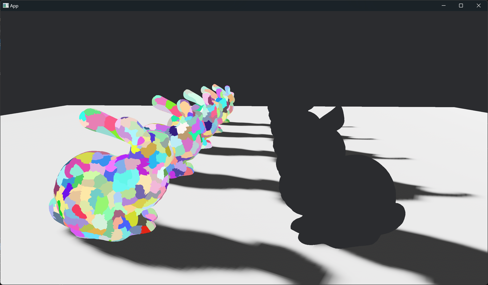
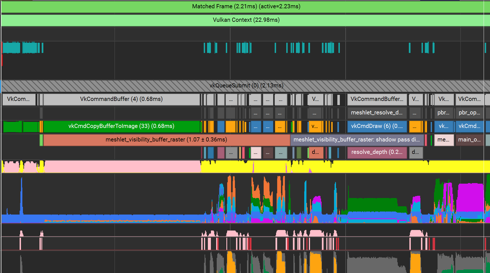
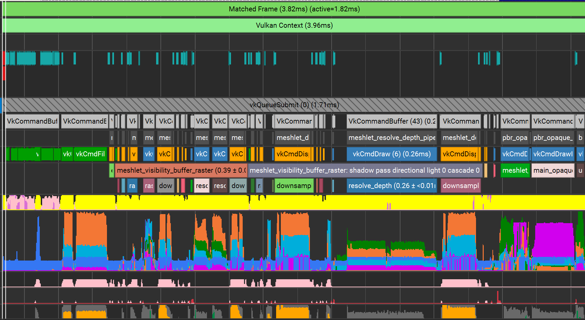
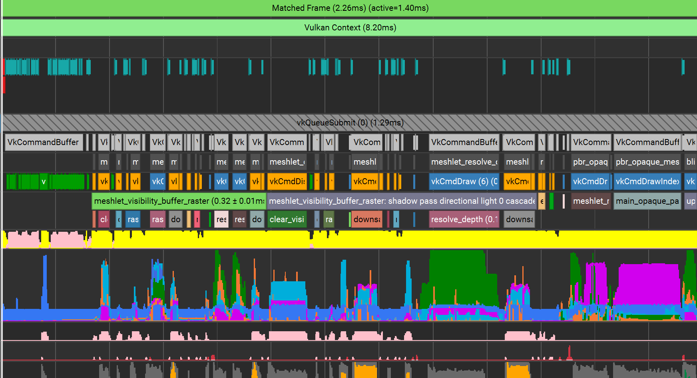

+++
title = "Virtual Geometry in Bevy 0.16"
date = "2025-03-27"

[taxonomies]
tags = ["bevy", "virtual geometry"]
+++

## Introduction

Bevy 0.16 is releasing soon, and as usual it's time for me to write about the progress I've made on virtual geometry over the last couple of months.

Due to a combination of life being busy, and taking an ongoing break from the project to work on other stuff (due to burnout), I haven't gotten as much done as the last two releases. This will be a much shorter blog post than usual.

## METIS-based Triangle Clustering
PR [#16947](https://github.com/bevyengine/bevy/pull/16947) improves the DAG quality.

I've said it before, and I'll say it again - DAG quality is the most important part of virtual geometry (and the hardest to get right).

Before, in order to group triangles into meshlets, I was simply relying on meshoptimizer's `meshopt_buildMeshlets()` function. It works pretty good for the general use case of splitting meshes into meshlets, but for virtual geometry, it's not ideal.

Meshoptimizer prioritizes generating nice clusters for culling and vertex reuse, but for virtual geometry, we want to ensure that meshlets share as few vertices as possible. Less shared vertices between meshlets means less locked vertices when simplifying, which leads to better DAG quality.

Minimizing shared vertices between meshlets when clustering triangles is the same problem as minimizing shared vertices between meshlet groups when grouping meshlets. We will once again use METIS to partition a graph, where nodes are triangles, edges connect adjacent triangles, and edge weights are the count of shared vertices between the triangles.

From there it was just a lot of experimentation and tweaking parameters in order to get METIS to generate good meshlets. The secret ingredients I discovered for good clustering are:
1. Set UFactor to 1 in METIS's options (did you know METIS has an options struct?), to ensure as little imbalance between partitions as possible.
2. Undershoot the partition count a little. Otherwise METIS will tend to overshoot and give you too many triangles per meshlet. For 128 max triangles per cluster, I set `partition_count = number_of_triangles.div_ceil(126)`.

With this, we get a nicer quality DAG. Up until now, I've been plagued by tiny <10 triangles meshlets that tend to get "stuck" and not simplify into higher LOD levels. Now we get nice and even meshlets that simplify well as we build the higher LOD levels.

<center>


*Old DAG*


*New DAG*

</center>

I'm still not done working on DAG quality - I haven't considered spatial positions of triangles/meshlets for grouping things yet - but this was a great step forwards.

## Texture Atomics
PR [#17765](https://github.com/bevyengine/bevy/pull/17765) improves the runtime performance.

Thanks once again to @atlv24's work on wgpu/naga, we now have access to atomic operations on u64/u32 storage textures!

Instead of using a plain GPU buffer to store our visbuffer, and buffer atomics to rasterize, we'll now use a R64Uint/R32Uint storage texture, and use texture atomics for rasterization.

Things get a little bit faster, mostly due to cache behaviors for texture-like access patterns being better with actual textures instead of buffers.

### Faster Depth Resolve

The real win however, was actually an entirely unrelated change I made in the same PR.

After rasterizing to the visbuffer texture (packed depth + cluster ID + triangle ID), there are two fullscreen triangle render passes to read from the visbuffer and write depth to both an actual depth texture, and the "material depth" texture discussed in previous posts.

Lets look at the material depth resolve shader:
```rust
@fragment
fn resolve_material_depth(in: FullscreenVertexOutput) -> @builtin(frag_depth) f32 {
    let visibility = textureLoad(meshlet_visibility_buffer, vec2<u32>(in.position.xy)).r;

    let depth = visibility >> 32u;
    if depth == 0lu { discard; } // This line is new

    let cluster_id = u32(visibility) >> 7u;
    let instance_id = meshlet_cluster_instance_ids[cluster_id];
    let material_id = meshlet_instance_material_ids[instance_id];
    return f32(material_id) / 65535.0;
}
```

For pixels where depth is 0 (i.e. the background, i.e. no meshes covering that pixel), we don't need to write depth out. The textures are already cleared to zero by the render pass setup.

Adding this single line to discard the background fragments doubled the performance of the resolve depth/material depth passes in the demo scene.

### Issues With Clearing

In Bevy we cache resource between frames, and so at the start of the frame, we need to clear the visbuffer texture back to zero to prepare it for use during the frame.

Wgpu has some simple `CommandEncoder::clear_buffer()` and `CommandEncoder::clear_texture()` commands. But their behavior under the hood might be a little unintuitive if you've never used Vulkan before.

When I initially switched the visbuffer from a buffer to a storage texture, and switched the clear from `CommandEncoder::clear_buffer()` to `CommandEncoder::clear_texture()`, I profiled and was shocked to see this:

<center>



</center>

0.68ms spent on a single vkCmdCopyBufferToImage, just to clear the texture. Before, using buffers, it was a simple vkCmdFillBuffer that took 0.01ms. What's going on?

Well, under the hood, `CommandEncoder::clear_texture()` maps to one of the following operations:
1. If the texture was created with the `TextureUsages::RENDER_ATTACHMENT` bit set, create a render pass with no draws and fragment load op = clear in order to clear the texture.
2. Otherwise allocate a big buffer filled with zeros, and then use vkCmdCopyBufferToImage to copy zeros to fill the texture.

Option #1 is out since R64Uint/R32Uint textures don't support the `TextureUsages::RENDER_ATTACHMENT` bit, and of course as we've found out, option #2 is horribly slow.

The _best_ option would be to use vkClearColorImage to clear the texture, which should be a similar fast path in the driver to using vkCmdFillBuffer with zeros, but wgpu neither uses vkClearColorImage internally, nor exposes it to users.

So instead I wrote a custom compute pass (and all the CPU-side boilerplate that that entails) to manually zero the texture, like so:
```rust
#ifdef MESHLET_VISIBILITY_BUFFER_RASTER_PASS_OUTPUT
@group(0) @binding(0) var meshlet_visibility_buffer: texture_storage_2d<r64uint, write>;
#else
@group(0) @binding(0) var meshlet_visibility_buffer: texture_storage_2d<r32uint, write>;
#endif
var<push_constant> view_size: vec2<u32>;

@compute
@workgroup_size(16, 16, 1)
fn clear_visibility_buffer(@builtin(global_invocation_id) global_id: vec3<u32>) {
    if any(global_id.xy >= view_size) { return; }

#ifdef MESHLET_VISIBILITY_BUFFER_RASTER_PASS_OUTPUT
    textureStore(meshlet_visibility_buffer, global_id.xy, vec4(0lu));
#else
    textureStore(meshlet_visibility_buffer, global_id.xy, vec4(0u));
#endif
}
```

Still not as fast as vkClearColorImage likely is, but much faster than 0.68ms.

### Texture Atomic Results

Overall perf improvement is about 0.42ms faster in a very simple demo scene.

<center>


*Old frame trace*


*New frame trace*

</center>

## Upcoming

And that's it for virtual geometry stuff I worked on during Bevy 0.16.

In related but non-Bevy news, Nvidia revealed their blackwell RTX 50 series GPUs, with some exciting [new meshlet/virtual geometry stuff](https://github.com/nvpro-samples/build_all?tab=readme-ov-file#mega-geometry)!

* New raytracing APIs (not rasterization!) for meshlet-based acceleration structures (CLAS) that are cheaper to build
  * And on blackwell, CLAS's use a compressed (but sadly opaque) memory format
* New demos using CLAS's for animated geometry, dynamic tesselation, and even full Nanite-style virtual geometry!
* New libraries for generating raytracing-friendly meshlets (i.e. optimized for bounding-box size), and virtual geometry oriented DAGs of meshlets

One of the biggest issues with Nanite (besides aggregate geometry like foilage) is that it came about right when realtime raytracing was starting to pick up. Until now, it hasn't been clear how to integrate virtual geometry with raytracing (beyond rasterizing the geometry to a gbuffer, so at least you get more primary visibility detail). These new APIs resolve that issue.

Meshoptimizer v0.23 also released recently, with some new APIs (`meshopt_buildMeshletsFlex`, `meshopt_partitionClusters`, `meshopt_computeSphereBounds`) that I need to try out for DAG building at some point.

Finally of course, I need to work on BVH-based culling for Bevy's virtual geometry. As I went over in my last post, culling is the biggest bottleneck at the moment. I did start working on it during the 0.16 dev cycle, but burned out before the end. We'll see what happens this cycle.

Enjoy Bevy 0.16!
