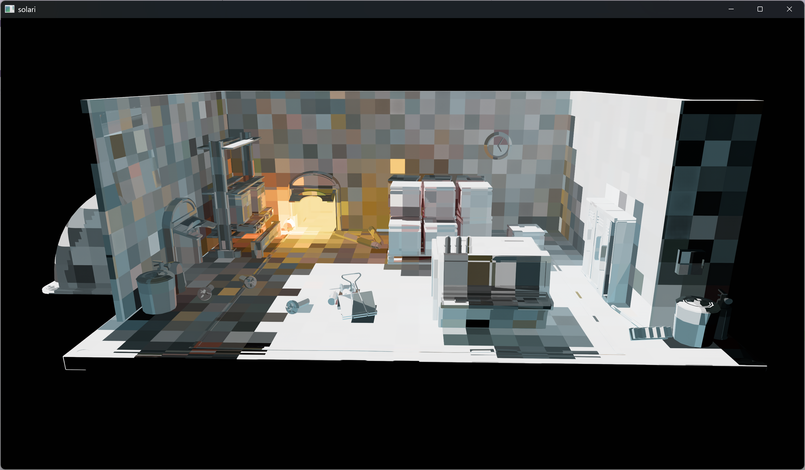
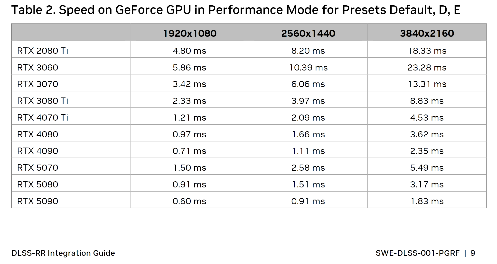
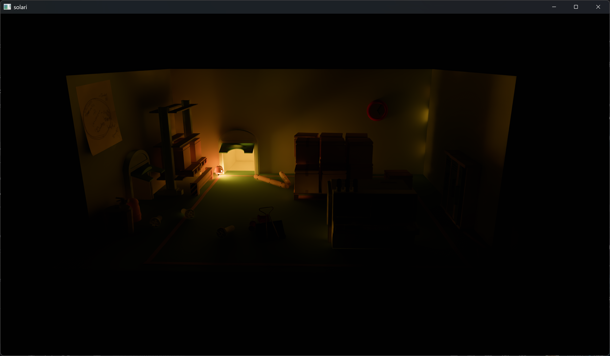

+++
title = "Realtime Raytracing in Bevy 0.17 (Solari)"
date = "2025-09-20"

[taxonomies]
tags = ["bevy", "raytracing"]
+++

Lighting a scene is hard! Anyone who's tried to make a 3D scene look good knows the frustration of placing light probes, tweaking shadow cascades, and trying to figure out why their materials don't look quite right.

Over the past few years, real-time raytracing has gone from a research curiosity to a shipping feature in major game engines, promising to solve many of these problems by simulating how light actually behaves.

With the release of v0.17, [Bevy](https://bevy.org) now joins the club with experimental support for hardware raytracing!

<video style="max-width: 100%; margin: var(--gap) var(--gap) 0 var(--gap); border-radius: 6px;" controls>
  <source src="solari_recording.mp4" type="video/mp4">
</video>
<center>

*[PICA PICA scene by SEED](https://github.com/SEED-EA/pica-pica-assets)*

</center>

Try it out yourself:
```bash
git clone https://github.com/bevyengine/bevy && cd bevy
git checkout release-0.17.0
cargo run --release --example solari --features bevy_solari,https
# Optionally setup DLSS support for NVIDIA GPUs following https://github.com/bevyengine/dlss_wgpu?tab=readme-ov-file#downloading-the-dlss-sdk
cargo run --release --example solari --features bevy_solari,https,dlss
```

## Introduction

Back in 2023, I [started](https://github.com/bevyengine/bevy/pull/10000) a project I called Solari to integrate hardware raytracing into Bevy's rendering pipeline. I was experimenting with [Lumen](https://youtu.be/2GYXuM10riw)-style screen space probes for global illumination, and later extended it to use [radiance cascades](https://radiance-cascades.com).

These techniques, while theoretically sound, proved challenging to use in practice. Screen space probes were tricky to get good quality out of (reusing and reprojecting the same probe across multiple pixels is hard!), and radiance cascades brought its own set of artifacts and performance costs.

On top of the algorithmic challenges, the ecosystem simply wasn't ready. Wgpu's raytracing support existed only as a work-in-progress PR that never got merged upstream. Maintaining a fork of wgpu (and by extension, Bevy) was time-consuming and unsustainable. After months of dealing with these challenges, I shelved the project.

In the 2 years since, I've learned a bunch more, raytracing has been upstreamed into wgpu, and raytracing algorithms have gotten much more developed. I've restarted the project with a new approach (ReSTIR, DLSS-RR), and soon it will be released as an official Bevy plugin!

In this post, I'll be doing a frame breakdown of how Solari works in Bevy 0.17, why I made certain choices, some of the challenges I faced, and some of the issues I've yet to solve.

## Why Raytracing for Bevy?

Before we start, I think it's fair to ask why an "indie" game engine needs high-end raytracing features that requires an expensive graphics card. The answer comes from my own experience learning 3D graphics.

Back when I was a teenager experimenting with small 3D games in Godot, I had a really hard time figuring out why my lighting looked so bad. Metallic objects didn't look reflective, scenes felt flat, and everything just looked wrong compared to the games I was playing.

I didn't understand that I was missing indirect light, proper reflections, and accurate shadows - I had no idea I was supposed to bake lighting.

This is the core problem that raytracing solves for indie developers. Even if not all players have hardware capable of running ray-traced effects, having a reference implementation of what lighting is *supposed* to look like is incredibly valuable.

With fully dynamic global illumination, reflections, shadows, and direct lighting, developers can see how their scenes should be lit. Then they can work backwards to replicate those results with baked lighting, screen-space techniques, and other less performance-intensive approximations.

Without that reference, it's really hard to know what you're missing or how to improve your lighting setup. Raytracing provides the ground truth that other techniques are trying to approximate.

Additionally, hardware is advancing all the time. Five years ago, raytracing was much less widespread than today. If you start developing a new game today with a 3-4 year lead time, raytracing is probably going to be even more common by the time you're ready to release it. Solari was in large part designed as a foward-looking rendering system.

There's also the practical consideration that if Bevy ever wants to attract AAA game developers, we need these kinds of systems. Recent AAA games like [DOOM: The Dark Ages](https://advances.realtimerendering.com/s2025/content/SOUSA_SIGGRAPH_2025_Final.pdf) and [Cyberpunk 2077](https://intro-to-restir.cwyman.org/presentations/2023ReSTIR_Course_Cyberpunk_2077_Integration.pdf) rely heavily on raytracing, and artists working on these types of projects expect their tools to support similar techniques.

And honestly? It's just cool, and something I love working on :)

## Frame Breakdown

In its initial release, Solari supports raytraced diffuse direct (DI) and indirect lighting (GI). Light can come from either [emissive](https://docs.rs/bevy/0.16.1/bevy/prelude/struct.StandardMaterial.html#structfield.emissive) triangle meshes, or analytic [directional lights](https://docs.rs/bevy/0.16.1/bevy/pbr/struct.DirectionalLight.html). Everything is fully realtime and dynamic, with no baking required.

Direct lighting is handled via ReSTIR DI, while indirect lighting is handled by a combination of ReSTIR GI and a world-space irradiance cache. Denoising is handled by DLSS Ray Reconstruction.

As opposed to coarse screen-space probes, per-pixel ReSTIR brings much better detail, along with being _considerably_ easier to get started with. I had my first prototype working in a weekend.

While I won't be covering ReSTIR from first principles (that could be its own entire blog post), [A Gentle Introduction to ReSTIR:
Path Reuse in Real-time](https://intro-to-restir.cwyman.org) and [A gentler introduction to ReSTIR](https://interplayoflight.wordpress.com/2023/12/17/a-gentler-introduction-to-restir) are both really great resources. If you haven't played with ReSTIR before, I suggest giving them a skim before continuing with this post. Or continue anyways, and just admire the pretty pixels :)

Onto the frame breakdown!

### GBuffer Raster

The first step of Solari is also the most boring: rasterize a standard GBuffer.

{{ figure(src="gbuffer_base_color.png", caption="Base color") }}
{{ figure(src="gbuffer_normals.png", caption="Normals") }}
{{ figure(src="gbuffer_position.png", caption="Position reconstructed from depth buffer") }}

#### Why Raster?

The GBuffer pass remains completely unchanged from standard Bevy (it's the same plugin). This might seem like a missed opportunity - after all, I could have used raytracing for primary visibility instead of rasterization - but I decided to stick with rasterization here.

By using raster for primary visibility, I maintain the option for people to use low-resolution proxy meshes in the raytracing scene, while still getting high quality meshes and textures in the primary view. The raster meshes can be full resolution with all their geometric detail, while the raytracing acceleration structure contains simplified versions that are cheaper to trace against.

Rasterization also works better with other Bevy features like [Virtual Geometry](https://jms55.github.io/tags/virtual-geometry).

#### Attachments

Bevy's GBuffer uses quite a bit of packing. The main attachment is a `Rgba32Uint` texture with each channel storing multiple values:

- **First channel**: sRGB base color and perceptual roughness packed as 4x8unorm
- **Second channel**: Emissive color stored as pre-exposed Rgb9e5
- **Third channel**: Reflectance, metallic, baked diffuse occlusion (unused by Solari), and an unused slot, again packed as 4x8unorm
- **Fourth channel**: World-space normal encoded into 24 bits via [octahedral encoding](https://www.jcgt.org/published/0003/02/01), plus 8 bits of flags meant for Bevy's default deferred shading (unused by Solari)

There's also a second `Rg16Float` attachment for motion vectors, and of course the depth attachment.

#### Drawing

The GBuffer rendering itself uses `multi_draw_indirect` to draw several meshes at once, using [sub-allocated](https://crates.io/crates/offset-allocator) buffers. Culling is done on the GPU using [two-pass occlusion culling](@/posts/2024_06_09_virtual_geometry_bevy_0_14/index.md#culling-first-pass) against a hierarchal depth buffer. Textures are handled bindlessly, and we try to minimize overall pipeline permutations.

These combined techniques keep draw call overhead and per-pixel overdraw fairly low, even for complex scenes.

### ReSTIR DI

In order to calculate direct lighting (light emitted by a light source, bouncing off a surface, and then hitting the camera), for each pixel, we need to loop over every light and point on those lights, and then calculate the light's contribution, as well as whether or not the light is visible.

This is very expensive, so realtime applications tend to approximate it by averaging many individual light samples. If you choose those samples well, you can get an approximate result that's very close to the real thing, without tons of expensive calculations.

To quickly estimate direct lighting, Solari uses a pretty standard ReSTIR DI setup.

ReSTIR DI randomly selects points on lights, and then shares the random samples between pixels based in order to choose the best light (most contribution to the image) for a given pixel.

#### DI Structure

Reservoirs store the light sample, confidence weight, and unbiased contribution weight (acting as the sample's PDF).

```rust
struct Reservoir {
    sample: LightSample,
    confidence_weight: f32,
    unbiased_contribution_weight: f32,
}
```

Direct lighting is handled in two compute dispatches. The first pass does initial and temporal resampling, while the second pass does spatial resampling and shading.

#### DI Initial Resampling

Initial sampling uses 32 samples from a light tile (more on this later), and chooses the brightest one via resampling importance sampling (RIS), using constant MIS weights.

32 samples per pixel is often overkill for scenes with a small number of lights. As this is one of the most expensive parts of Solari, I'm planning on letting users control this number in a future release.

After choosing the best sample, we trace a ray to test visibility, setting the unbiased contribution weight to 0 in the case of occlusion.


All raytracing in Solari is handled via inline ray queries. Wgpu does not yet support raytracing pipelines, so I haven't gotten a chance to play around with them.


{{ figure(src="noisy_di_one_sample.png", caption="One candidate sample DI") }}
{{ figure(src="noisy_di_32_samples.png", caption="32 candidate sample DI, one sample chosen via RIS") }}

#### DI Temporal Resampling

A temporal reservoir is then obtained via motion vectors and last frame's pixel data. We validate the reprojection using the `pixel_dissimilar` heuristic. We also need to check that the temporal light sample still exists in the current frame (i.e. the light has not been despawned).

Additionally, the chosen light from last frame might no longer be visible this frame, e.g. if an object moved behind a wall. We could trace an additional ray here to validate visibility, but it's cheaper to just assume that the temporal light sample is still visible from the current pixel this frame.

Reusing temporal visibility saves one raytrace, at the cost of shadows for moving objects being delayed by 1 frame, and some slighty darker/wider shadows. Overall the artifacts are not very noticable, so I find that it's well worth reusing visibility for the temporal reservoir resampling.

The initial and temporal reservoir are then merged together using constant MIS weights. I tried using the balance heuristic, but didn't notice much difference for DI, and constant MIS weights are much cheaper.

```rust
// Reject if tangent plane difference difference more than 0.3% or angle between normals more than 25 degrees
fn pixel_dissimilar(depth: f32, world_position: vec3<f32>, other_world_position: vec3<f32>, normal: vec3<f32>, other_normal: vec3<f32>) -> bool {
    // https://developer.download.nvidia.com/video/gputechconf/gtc/2020/presentations/s22699-fast-denoising-with-self-stabilizing-recurrent-blurs.pdf#page=45
    let tangent_plane_distance = abs(dot(normal, other_world_position - world_position));
    let view_z = -depth_ndc_to_view_z(depth);

    return tangent_plane_distance / view_z > 0.003 || dot(normal, other_normal) < 0.906;
}
```

#### DI Spatial Resampling

The second pass handles spatial resampling. We choose one random pixel within a 30 pixel-radius disk, and borrow its reservoir. We use the same `pixel_dissimilar` heuristic as the temporal pass to validate the spatial reservoir.

We must also trace a ray to test visibility, as the reservoir comes from a neighboring pixel, and we cannot assume that the same light sample visible at the neighbor pixel is also visible for the current pixel.

Unlike a lot of other ReSTIR implementations, we only ever use 1 spatial sample. Using more than 1 sample does not tend to improve quality, and increases performance costs. We cannot, however, skip spatial resampling entirely. Having a source of new samples from other pixels is crucial to prevent artifacts from temporal resampling.

{{ figure(src="spatial_baseline.jpg", caption="1 random spatial sample, 6.4 ms") }}

Spatial sampling is probably the least well-researched part of ReSTIR. I tried a couple of other schemes, including trying to reuse reservoirs across a workgroup/subgroup similar to [Histogram Stratification for Spatio-Temporal Reservoir Sampling](https://iribis.github.io/publication/2025_Stratified_Histogram_Resampling), but none of them worked out well.

Subgroups-level resampling was very cheap, but had tiling artifacts, and was not easily portable to different machines with different amounts of threads per workgroup.

{{ figure(src="spatial_subgroup.jpg", caption="Subgroup-level spatial resampling, 7.3 ms") }}

Workgroup-level resampling had much better quality, but was twice as expensive compared to 1 spatial sample, and introduced correlations that broke the denoiser.

{{ figure(src="spatial_workgroup.jpg", caption="Workgroup-level spatial resampling, 12 ms") }}

In the end, I stuck with the 1 random spatial sample I described above.

The reservoir produced by the first pass and the spatial reservoir are combined with the same routine that we used for merging initial and temporal reservoirs.

#### DI Shading

Once the final reservoir is produced, we can use its chosen light sample to shade the pixel, producing the final direct lighting.

I did try out shading the pixel using all 3 samples (initial, temporal, and spatial), weighed by their resampling probabilities as [Rearchitecting Spatiotemporal Resampling for Production](https://cwyman.org/papers/hpg21_rearchitectingReSTIR.pdf) suggests, but had noisier results compared to shading using the final reservoir only. I'm not sure if I messed up the implementation or what.

Overall the DI pass uses two raytraces per pixel (1 initial, 1 spatial).

{{ figure(src="noisy_di.png", caption="DI with 32 initial candidates, 1 temporal resample, and 1 spatial resample") }}

### ReSTIR GI

Indirect lighting (light emitted by a light source, bouncing off more than 1 surface, and then hitting the camera) is even more expensive to calculate than direct lighting, as you need to trace multiple bounces of each ray to calculate the lighting for a given path.

To quickly estimate indirect lighting, Solari uses ReSTIR GI, with a very similar setup to the previous ReSTIR DI.

Where as ReStir DI picks the best light, ReSTIR GI randomly selects directions in a hemisphere, and then shares the random samples between pixels in order to choose the best 1-bounce _path_ for a given pixel.

#### GI Structure

Reservoirs store the cached radiance bouncing off of the sample point, sample point geometry info, confidence weight, and unbiased contribution weight.

```rust
struct Reservoir {
    radiance: vec3<f32>,
    sample_point_world_position: vec3<f32>,
    sample_point_world_normal: vec3<f32>,
    confidence_weight: f32,
    unbiased_contribution_weight: f32,
}
```

I tried some basic packing schemes for the GI reservoir (Rgb9e5 radiance, octahedral-encoded normals), but didn't find that it meaningfully reduced GI costs. Reservoir memory bandwidth is not a big bottleneck compared to raytracing and reading mesh/texture data for ray intersections.

I have heard that people had good results storing reservoirs as struct-of-arrays instead of array-of-structs, so I'll likely revist this topic at some point.

ReSTIR GI again uses two compute dispatches, with the first pass doing initial and temporal resampling, and the second pass doing spatial resampling and shading.

#### GI Initial Sampling

GI samples are much more expensive to generate than DI samples (tracing paths is more expensive than looping over a list of light sources), so for initial sampling, we only generate 1 sample.

We start by tracing a ray along a random direction chosen from a uniform hemisphere distribution. At some point I also want to try using [spatiotemporal blue noise](https://github.com/electronicarts/fastnoise). Although DLSS-RR recommends white noise, the docs do say that blue noise with a sufficiently long period can also work.

At the ray's hit point, we need to obtain an estimate of the incoming irradiance, which becomes the outgoing radiance towards the current pixel, i.e. the path's contribution.

{{ figure(src="noisy_gi_one_sample.png", caption="One sample GI") }}

To obtain irradiance, we query the world cache at the hit point (more on this later).

```rust
fn generate_initial_reservoir(world_position: vec3<f32>, world_normal: vec3<f32>, rng: ptr<function, u32>) -> Reservoir {
    var reservoir = empty_reservoir();

    let ray_direction = sample_uniform_hemisphere(world_normal, rng);
    let ray_hit = trace_ray(world_position, ray_direction, RAY_T_MIN, RAY_T_MAX, RAY_FLAG_NONE);

    if ray_hit.kind == RAY_QUERY_INTERSECTION_NONE {
        return reservoir;
    }

    let sample_point = resolve_ray_hit_full(ray_hit);

    // Direct lighting is handled by ReSTIR DI
    if all(sample_point.material.emissive != vec3(0.0)) {
        return reservoir;
    }

    reservoir.unbiased_contribution_weight = uniform_hemisphere_inverse_pdf();
    reservoir.sample_point_world_position = sample_point.world_position;
    reservoir.sample_point_world_normal = sample_point.world_normal;
    reservoir.confidence_weight = 1.0;

    reservoir.radiance = query_world_cache(sample_point.world_position, sample_point.geometric_world_normal, view.world_position);

    let sample_point_diffuse_brdf = sample_point.material.base_color / PI;
    reservoir.radiance *= sample_point_diffuse_brdf;

    return reservoir;
}
```

#### GI Temporal and Spatial Resampling

Temporal reservoir selection for GI is a little different from DI.

In addition to reprojecting based on motion vectors, we jitter the reprojected location by a few pixels in either direction using [permutation sampling](https://www.amazon.com/GPU-Zen-Advanced-Rendering-Techniques/dp/B0DNXNM14K). This essentially adds a small spatial component to the temporal resampling, which helps break up temporal correlations.

{{ figure(src="no_permutation_sampling.png", caption="No permutation sampling: The denoiser (DLSS-RR) produces blotchy noise") }}

I also tried permutation sampling for ReSTIR DI, and while it did reduce correlation artifacts, it also added even worse artifacts because we reuse visibility, which becomes very obvious under permutation sampling. Tracing an extra ray to validate visibility would fix this, but I'm not quite ready to pay that performance cost.

{{ figure(src="di_permutation_sampling.png", caption="DI: Permutation sampling and visibility reuse do not work well together") }}

Spatial reservoir selection for GI is identical to DI.

Reservoir merging for GI uses the balance heuristic for MIS weights, and includes the BRDF contribution, as I found that unlike for DI, these make a significant quality difference. The balance heuristic is not much more expensive here, as we are only ever merging two reservoirs at a time.

#### GI Jacobian

Additionally, since both temporal and spatial resampling use neighboring pixels, we need to add a Jacobian determinant to the MIS weights to account for the change in sampling domain.

The Jacobian proved to be the absolute hardest part of ReSTIR GI for me. While it makes the GI more correct, it also adds a lot of noise in corners. Worse, the Jacobian tends to make the GI calculations "explode" into super high numbers that result in overflow to `inf`, which then spreads over the entire screen due to resampling and denoising.

The best solution I have found to reduce artifacts from the Jacobian is to reject neighbor samples when the Jacobian is greater than 2 (i.e., a neighboring sample reused at the current pixel would have more than 2x the contribution it originally did). While this somewhat works, there are still issues with stability. If I leave Solari running for a couple of minutes in the same spot, it will eventually lead to overflow. I haven't yet figured out how to prevent this.

Using the balance heuristic (and factoring in the two Jacobians) for MIS weights when resampling also helped a lot with fighting the noise introduced by the Jacobian.

#### GI Shading

Once the final reservoir is produced, we can use it to shade the pixel, producing the final indirect lighting.

Since we're using DLSS-RR for denoising, we can simply add the GI on top of the existing framebuffer (holding the DI). There's no need to write to a separate buffer for use with a separate denoising process, unlike a lot of other GI implementations.

Overall the GI pass uses two raytraces per pixel (1 initial, 1 spatial), same as DI.

{{ figure(src="noisy_gi.png", caption="GI with 1 initial candidate, 1 temporal resample, and 1 spatial resample") }}

### Interlude: What is ReSTIR Doing?

I have heard ReSTIR described as a signal _amplifier_. If you feed it decent samples, it's likely to produce a good sample. If you feed it good samples, it's likely to produce a great sample.

The better your initial sampling, the better ReSTIR does. The quality of your final result heavily depends on the quality of the initial samples you feed into it.

For this reason, it's important that you spend time improving the initial sampling process. This could take the form of generating more initial samples, or improving your sampling strategy.

For ReSTIR DI, taking more initial samples is viable, as samples are just random lights, and are fairly cheap to generate.

For ReSTIR GI, even 1 initial sample is already expensive, as each sample involves tracing a ray. Instead of increasing initial sample count, we'll have to be smart about _how_ we obtain that 1 sample.

In the next two sections of the frame breakdown, we will discuss how I improved initial sampling for ReSTIR DI and GI.

### Light Tile Presampling

While generating initial samples for ReSTIR DI is fairly cheap, when we start taking 32 or more samples per pixel, the memory bandwidth costs quickly add up. In order to make 32 samples per pixel viable, we'll need a way to improve our cache coherency.

In this section, we will generate some light tile buffers, following section 5 of [Rearchitecting Spatiotemporal Resampling for Production](https://cwyman.org/papers/hpg21_rearchitectingReSTIR.pdf).

#### Light Sampling APIs

Before I can explain light tiles, we first need to talk about Solari's shader API for working with light sources.

Bevy stores light sources as a big list of objects on the GPU. All emissive meshes and directional lights get collected by the CPU, and put in this list.

When calculating radiance emitted by a light source, Bevy works with specific light _samples_ - not the whole light at once. A `LightSample` uniquely identifies a specific subset of the light source, e.g. a specific point on an emissive mesh.

```rust
struct LightSample {
    light_id: u16,
    triangle_id: u16, // Unused for directional lights
    seed: u32,
}

fn generate_random_light_sample(rng: ptr<function, u32>) -> LightSample {
    let light_count = arrayLength(&light_sources);
    let light_id = rand_range_u(light_count, rng);

    let light_source = light_sources[light_id];

    var triangle_id = 0u;
    if light_source.kind != LIGHT_SOURCE_KIND_DIRECTIONAL {
        let triangle_count = light_source.kind >> 1u;
        triangle_id = rand_range_u(triangle_count, rng);
    }

    let seed = rand_u(rng);

    return LightSample(light_id, triangle_id, seed);
}
```

The light ID points to the overall light source object in the big list of lights.

The seed is used to initialize a random number generator (RNG). For directional lights, the RNG is used to choose a direction within a cone. For emissive meshes, the RNG is used to choose a specific point on the triangle identified by the triangle ID.

A `LightSample` can be resolved, giving some info on its properties:

```rust
struct ResolvedLightSample {
    world_position: vec4<f32>, // w component is 0.0 for directional lights, and 1.0 for emissive meshes
    world_normal: vec3<f32>,
    emitted_radiance: vec3<f32>,
    inverse_pdf: f32,
}

fn resolve_light_sample(light_sample: LightSample, light_source: LightSource) -> ResolvedLightSample {
    if light_source.kind == LIGHT_SOURCE_KIND_DIRECTIONAL {
        let directional_light = directional_lights[light_source.id];

        let direction_to_light = sample_cone(directional_light);

        return ResolvedLightSample(
            vec4(direction_to_light, 0.0),
            -direction_to_light,
            directional_light.luminance,
            directional_light.inverse_pdf,
        );
    } else {
        let triangle_count = light_source.kind >> 1u;
        let triangle_id = light_sample.light_id & 0xFFFFu;
        let barycentrics = triangle_barycentrics(light_sample.seed);

        // Interpolates and transforms vertex positions, UVs, etc, and samples material textures
        let triangle_data = resolve_triangle_data_full(light_source.id, triangle_id, barycentrics);

        return ResolvedLightSample(
            vec4(triangle_data.world_position, 1.0),
            triangle_data.world_normal,
            triangle_data.material.emissive.rgb,
            f32(triangle_count) * triangle_data.triangle_area,
        );
    }
}
```

And finally a `ResolvedLightSample` can be used to calculate the received radiance at a point from the light sample, also known as the unshadowed light contribution:

```rust
struct LightContribution {
    received_radiance: vec3<f32>,
    inverse_pdf: f32,
    wi: vec3<f32>,
}

fn calculate_resolved_light_contribution(resolved_light_sample: ResolvedLightSample, ray_origin: vec3<f32>, origin_world_normal: vec3<f32>) -> LightContribution {
    let ray = resolved_light_sample.world_position.xyz - (resolved_light_sample.world_position.w * ray_origin);
    let light_distance = length(ray);
    let wi = ray / light_distance;

    let cos_theta_origin = saturate(dot(wi, origin_world_normal));
    let cos_theta_light = saturate(dot(-wi, resolved_light_sample.world_normal));
    let light_distance_squared = light_distance * light_distance;

    let received_radiance = resolved_light_sample.emitted_radiance * cos_theta_origin * (cos_theta_light / light_distance_squared);

    return LightContribution(received_radiance, resolved_light_sample.inverse_pdf, wi);
}
```

Notably, only the first and second steps (generating a `LightSample`, resolving it into a `ResolvedLightSample`) involve branching based on the type of light (directional or emissive). Calculating the light contribution involves no branching.

#### Presampling Lights

The straightforward way to implement ReSTIR DI initial sampling is to perform the whole light sampling process (generate -> resolve -> calculate contribution) all in one shader.

Indeed, for my first ReSTIR DI prototype, this is what I did - but performance was terrible.

By generating the light sample, resolving it, and then calculating its contribution all in the same shader, we're introducing a lot of divergent branches and incoherent memory accesses. If there's one thing GPUs hate, it's divergence. GPUs perform better when all threads in a group are executing the same branch and don't need masking, and when the threads are all accessing similar memory locations that are likely in a nearby cache.

Instead, we can separate out the steps. Generating a bunch of random light samples and resolving them can be performed ahead of time, by a separate shader. We can then pack the resolved samples and store them in a buffer.

```rust
fn pack_resolved_light_sample(sample: ResolvedLightSample) -> ResolvedLightSamplePacked {
    return ResolvedLightSamplePacked(
        sample.world_position.x,
        sample.world_position.y,
        sample.world_position.z,
        pack2x16unorm(octahedral_encode(sample.world_normal)),
        vec3_to_rgb9e5_(sample.radiance * view.exposure),
        sample.inverse_pdf * select(1.0, -1.0, sample.world_position.w == 0.0),
    );
}

fn unpack_resolved_light_sample(packed: ResolvedLightSamplePacked, exposure: f32) -> ResolvedLightSample {
    return ResolvedLightSample(
        vec4(packed.world_position_x, packed.world_position_y, packed.world_position_z, select(1.0, 0.0, packed.inverse_pdf < 0.0)),
        octahedral_decode(unpack2x16unorm(packed.world_normal)),
        rgb9e5_to_vec3_(packed.radiance) / exposure,
        abs(packed.inverse_pdf),
    );
}
```

We call these presampled sets of lights "light tiles". Following the paper, we perform a compute dispatch to generate a fixed 128 tiles (these are not screen-space tiles), each with 1024 samples (`ResolvedLightSamplePacked`).

Samples are generated completely randomly, without any info about the scene - there is no spatial heuristic or any way of identifying "good" samples.

ReSTIR DI initial sampling can now pick a random tile, and then random samples within the tile, and use `calculate_resolved_light_contribution()` to calculate their radiance.

With light tiles, we have much higher cache hit rates when sampling lights, which greatly improves our performance. In fact, even more than the actual raytracing - light sampling is by far the biggest performance bottleneck in Solari.

### World Cache

With light tiles accelerating initial sampling for ReSTIR DI, it's time to talk about how we accelerate initial sampling for ReSTIR GI.

Unlike DI, where generating more samples is relatively cheap, for GI we can only afford 1 sample. However, unlike DI, GI is a lot more forgiving of inaccuracies. GI just has to be "mostly correct".

We can take advantage of that fact by sharing the same work amongst multiple pixels, via the use of a world-space irradiance cache.



The world cache voxelizes the world, storing accumulated irradiance (light hitting the surface) at each voxel.

When sampling indirect lighting in ReSTIR GI, rather than having to trace additional rays towards light sources to estimate the irradiance, we can simply lookup the irradiance at the given voxel.

The world cache both amortizes the cost of the GI pass, and reduces variance, especially for newly-disoccluded pixels for which the screen-space ReSTIR GI has no temporal history.

Adding the world cache both significantly improved quality, and halved the time spent on the initial GI sampling.

#### Cache Querying

The world cache uses [spatial hashing](https://arxiv.org/pdf/1902.05942v1) to discretize the world. Unlike other options such as [clipmaps](https://github.com/EmbarkStudios/kajiya/blob/main/docs/gi-overview.md#irradiance-cache-055ms), [cards](https://advances.realtimerendering.com/s2022/SIGGRAPH2022-Advances-Lumen-Wright%20et%20al.pdf#page=59), or [bricks](https://gpuopen.com/download/GDC2024_GI_with_AMD_FidelityFX_Brixelizer.pdf), spatial hashing requires no explicit build step, and automatically adapts to scene geometry while having minimal light leaks.

With spatial hashing, a given descriptor (e.g. `{position, normal}`) hashes to a `u32` key. This key corresponds to an index within a fixed-size buffer, which holds whatever values you want to store in the hashmap - in our case, irradiance.

Either the entry that you're querying corresponds to some existing entry (same checksum), and you can return the value, or the entry does not exist (empty checksum), and you can initialize the entry by writing the checksum to it.

The checksum is the same descriptor, hashed to a different key via a different hash function, and is used to detect hash collisions.

The `query_world_cache()` function below is what ReSTIR GI uses to lookup irradiance at the hit point for raytraces.

```rust
fn query_world_cache(world_position: vec3<f32>, world_normal: vec3<f32>, view_position: vec3<f32>) -> vec3<f32> {
    let cell_size = get_cell_size(world_position, view_position);

    let world_position_quantized = bitcast<vec3<u32>>(quantize_position(world_position, cell_size));
    let world_normal_quantized = bitcast<vec3<u32>>(quantize_normal(world_normal));

    var key = compute_key(world_position_quantized, world_normal_quantized);
    let checksum = compute_checksum(world_position_quantized, world_normal_quantized);

    for (var i = 0u; i < WORLD_CACHE_MAX_SEARCH_STEPS; i++) {
        let existing_checksum = atomicCompareExchangeWeak(&world_cache_checksums[key], WORLD_CACHE_EMPTY_CELL, checksum).old_value;
        if existing_checksum == checksum {
            // Cache entry already exists - get irradiance and reset cell lifetime
            atomicStore(&world_cache_life[key], WORLD_CACHE_CELL_LIFETIME);
            return world_cache_irradiance[key].rgb;
        } else if existing_checksum == WORLD_CACHE_EMPTY_CELL {
            // Cell is empty - reset cell lifetime so that it starts getting updated next frame
            atomicStore(&world_cache_life[key], WORLD_CACHE_CELL_LIFETIME);
            world_cache_geometry_data[key].world_position = world_position;
            world_cache_geometry_data[key].world_normal = world_normal;
            return vec3(0.0);
        } else {
            // Collision - jump to another entry
            key = wrap_key(pcg_hash(key));
        }
    }

    return vec3(0.0);
}
```

In Solari, the descriptor is a combination of the `world_position` of the query point, the `geometric_world_normal` (shading normal is too detailed) of the query point, and a LOD factor that's used to reduce cell count for far-away query points.

```rust
fn quantize_position(world_position: vec3<f32>, quantization_factor: f32) -> vec3<f32> {
    return floor(world_position / quantization_factor + 0.0001);
}

fn quantize_normal(world_normal: vec3<f32>) -> vec3<f32> {
    return floor(world_normal + 0.0001);
}

fn compute_key(world_position: vec3<u32>, world_normal: vec3<u32>) -> u32 {
    var key = pcg_hash(world_position.x);
    key = pcg_hash(key + world_position.y);
    key = pcg_hash(key + world_position.z);
    key = pcg_hash(key + world_normal.x);
    key = pcg_hash(key + world_normal.y);
    key = pcg_hash(key + world_normal.z);
    return wrap_key(key);
}

fn compute_checksum(world_position: vec3<u32>, world_normal: vec3<u32>) -> u32 {
    var key = iqint_hash(world_position.x);
    key = iqint_hash(key + world_position.y);
    key = iqint_hash(key + world_position.z);
    key = iqint_hash(key + world_normal.x);
    key = iqint_hash(key + world_normal.y);
    key = iqint_hash(key + world_normal.z);
    return key;
}
```

{{ figure(src="world_cache_far.png", caption="World cache from further away, showing LOD") }}

#### Cache Decay

In order to maintain the world cache, we need a series of passes to decay and update active entries.

The first compute dispatch checks every entry in the hashmap, decaying their "life" count by 1. Each entry's life is initialized when the entry is created, and is reset when queried.

When an entry reaches 0 life, we clear out the entry, freeing up a space for future voxels to use.

```rust
@compute @workgroup_size(1024, 1, 1)
fn decay_world_cache(@builtin(global_invocation_id) global_id: vec3<u32>) {
    var life = world_cache_life[global_id.x];
    if life > 0u {
        // Decay and write new life
        life -= 1u;
        world_cache_life[global_id.x] = life;

        // Clear cells that become dead
        if life == 0u {
            world_cache_checksums[global_id.x] = WORLD_CACHE_EMPTY_CELL;
            world_cache_irradiance[global_id.x] = vec4(0.0);
        }
    }
}
```

#### Cache Compact

The next three dispatches compact and count the total number of active entries in the world cache. This produces a dense array of indices of active entries, as well as indirect dispatch parameters for the next two passes.

The code is just a standard parallel prefix-sum, so I'm going to skip showing it.

#### Cache Update

Now that we know the list of active entries in the world cache (and can perform indirect dispatches to process each active entry), it's time to update the irradiance estimate for each voxel.

The first part of the update process is taking new samples of the scene's lighting.

Two rays are traced per voxel: a direct light sample, and an indirect light sample.

```rust
@compute @workgroup_size(1024, 1, 1)
fn sample_irradiance(@builtin(workgroup_id) workgroup_id: vec3<u32>, @builtin(global_invocation_id) active_cell_id: vec3<u32>) {
    if active_cell_id.x < world_cache_active_cells_count {
        // Get voxel data
        let cell_index = world_cache_active_cell_indices[active_cell_id.x];
        let geometry_data = world_cache_geometry_data[cell_index];
        var rng = cell_index + constants.frame_index;

        // Sample direct lighting via RIS (1st ray)
        var new_irradiance = sample_random_light_ris(geometry_data.world_position, geometry_data.world_normal, workgroup_id.xy, &rng);

        // Sample indirect lighting via BRDF sampling + world cache querying (2nd ray)
        let ray_direction = sample_cosine_hemisphere(geometry_data.world_normal, &rng);
        let ray_hit = trace_ray(geometry_data.world_position, ray_direction, RAY_T_MIN, RAY_T_MAX, RAY_FLAG_NONE);
        if ray_hit.kind != RAY_QUERY_INTERSECTION_NONE {
            let ray_hit = resolve_ray_hit_full(ray_hit);
            new_irradiance += ray_hit.material.base_color * query_world_cache(ray_hit.world_position, ray_hit.geometric_world_normal, view.world_position);
        }

        world_cache_active_cells_new_irradiance[active_cell_id.x] = new_irradiance;
    }
}
```

The direct light sample is chosen via RIS, and uses the same presampled light tiles that we're going to use for ReSTIR DI. It's basically the same process as ReSTIR DI initial candidate sampling.

I've thought about using ReSTIR (well, ReTIR, without the spatial resampling part) for the world cache, but it's not something I've tried yet.

The indirect light sample is a little more interesting.

In order to estimate indirect lighting, we trace a ray using a cosine-hemisphere distribution. At the ray hit point, we query the world cache.

You might be thinking "Wait, aren't we _updating_ the cache? But we're also sampling from the same cache in order to... update it?"

By having the cache sample from itself, we form a full path tracer, where tracing the path is spread out across multiple frames (for performance).

As an example: In frame 5, world cache cell A samples a light source. In frame 6, a different world cache cell B samples cell A. In frame 7, yet another world cache cell C samples cell B. We've now formed a multi-bounce path `light source->A->B->C`, and once ReSTIR GI gets involved, `light source->A->B->C->primary surface->camera`.

By having the cache sample itself, we get full-length multi-bounce paths, instead of just single-bounce paths. In indoor scenes that make heavy use of indirect lighting, the difference is pretty dramatic.

{{ figure(src="cornell_box_no_multi_bounce.png", caption="Single-bounce lighting") }}
{{ figure(src="cornell_box_multi_bounce.png", caption="Multi-bounce lighting") }}

#### Cache Blend

The second and final step of the world cache update process is to blend the new light samples with the existing irradiance samples, giving us an estimate of the overall irradiance via temporal accumulation. If you've ever seen code for temporal antialiasing, this should look pretty familiar.

The blending factor is based on the total sample count of voxel, capped at a max value. New voxels without any existing irradiance estimate use more of the new sample's contribution, while existing voxels with existing irradiance estimates use less of the new sample.

Choosing the max sample count is a tradeoff between having the cache be stable and low-variance, and having the cache be responsive to changes in the scene's lighting.

It's also important to note that this is a separate compute dispatch from the previous dispatch we used for sampling lighting. If the passes were combined, we would have data races from voxels writing new irradiance estimates at the same time other voxels were querying them.

```rust
@compute @workgroup_size(1024, 1, 1)
fn blend_new_samples(@builtin(global_invocation_id) active_cell_id: vec3<u32>) {
    if active_cell_id.x < world_cache_active_cells_count {
        let cell_index = world_cache_active_cell_indices[active_cell_id.x];

        let old_irradiance = world_cache_irradiance[cell_index];
        let new_irradiance = world_cache_active_cells_new_irradiance[active_cell_id.x];
        let sample_count = min(old_irradiance.a + 1.0, WORLD_CACHE_MAX_TEMPORAL_SAMPLES);

        let blended_irradiance = mix(old_irradiance.rgb, new_irradiance, 1.0 / sample_count);

        world_cache_irradiance[cell_index] = vec4(blended_irradiance, sample_count);
    }
}
```

### DLSS Ray Reconstruction

Once we have our noisy estimate of the scene, we run it through DLSS-RR to upscale, antialias, and denoise it.

{{ figure(src="noisy_full.png", caption="Noisy and aliased image") }}
{{ figure(src="denoised_full.png", caption="Denoised and antialiased image") }}
{{ figure(src="pathtraced.png", caption="Pathtraced reference") }}

While ideally we would be able to configure DLSS-RR to read directly from our GBuffer, we unfortunately need a small pass to first copy from the GBuffer to some standalone textures. DLSS-RR will read these textures as inputs to help guide the denoising pass.

DLSS-RR is called via the [dlss_wgpu](https://crates.io/crates/dlss_wgpu) wrapper I wrote, which is integrated into bevy_anti_alias as a Bevy plugin.


The dlss_wgpu crate is standalone, and can also be used by non-Bevy projects that are using wgpu!


{{ figure(src="denoised_di.png", caption="Denoised and antialiased image - DI only") }}
{{ figure(src="denoised_gi.png", caption="Denoised and antialiased image - GI only") }}

## Performance

### Numbers

Timings for all scenes were measured on an RTX 3080, rendered at 1600x900, and upscaled to 3200x1800 using DLSS-RR performance mode.

{{ figure(src="pica_pica_perf.png", caption="PICA PICA") }}
{{ figure(src="bistro_perf.png", caption="Bistro") }}
{{ figure(src="cornell_box_perf.png", caption="Cornell Box") }}

<!-- |                Pass               | PICA PICA Duration (ms) | Bistro Duration (ms) | Cornell Box Duration (ms) | Dependent On |
|:---------------------------------:|:-----------------------:|:--------------------:|:-------------------------:|:------------:|
| Presample Light Tiles             | 0.02761                 | 0.08403              | 0.02436                   | Negligible   |
| World Cache: Decay Cells          | 0.01508                 | 0.02007              | 0.01484                   | Negligible   |
| World Cache: Compaction P1        | 0.03823                 | 0.04357              | 0.03776                   | Negligible   |
| World Cache: Compaction P2        | 0.00862                 | 0.00903              | 0.00858                   | Negligible   |
| World Cache: Write Active Cells   | 0.01451                 | 0.01942              | 0.00138                   | Negligible   |
| World Cache: Sample Lighting      | 0.06009                 | 2.09000              | 0.05367                   | World size   |
| World Cache: Blend New Samples    | 0.01286                 | 0.06737              | 0.01272                   | Negligible   |
| ReSTIR DI: Initial + Temporal     | 1.25000                 | 1.85000              | 1.28000                   | Pixel count  |
| ReSTIR DI: Spatial + Shade        | 0.18628                 | 0.65952              | 0.18127                   | Pixel count  |
| ReSTIR GI: Initial + Temporal     | 0.36913                 | 2.75000              | 0.32722                   | Pixel count  |
| ReSTIR GI: Spatial + Shade        | 0.44301                 | 0.59905              | 0.45791                   | Pixel count  |
| DLSS-RR: Copy Inputs From GBuffer | 0.04185                 | 0.06789              | 0.03517                   | Pixel count  |
| DLSS-RR                           | 5.75000                 | 6.29000              | 5.82000                   | Pixel count  |
| Total                             | 8.21727                 | 14.54995             | 8.25488                   | N/A          | -->

|                Pass               | PICA PICA Duration (ms) | Bistro Duration (ms) | Cornell Box Duration (ms) | Dependent On |
|:---------------------------------:|:-----------------------:|:--------------------:|:-------------------------:|:------------:|
| Presample Light Tiles             | 0.03                    | 0.08                 | 0.02                      | Negligible   |
| World Cache: Decay Cells          | 0.02                    | 0.02                 | 0.01                      | Negligible   |
| World Cache: Compaction P1        | 0.04                    | 0.04                 | 0.04                      | Negligible   |
| World Cache: Compaction P2        | 0.01                    | 0.01                 | 0.01                      | Negligible   |
| World Cache: Write Active Cells   | 0.01                    | 0.02                 | 0.01                      | Negligible   |
| World Cache: Sample Lighting      | 0.06                    | 2.09                 | 0.05                      | World size   |
| World Cache: Blend New Samples    | 0.01                    | 0.07                 | 0.01                      | Negligible   |
| ReSTIR DI: Initial + Temporal     | 1.25                    | 1.85                 | 1.28                      | Pixel count  |
| ReSTIR DI: Spatial + Shade        | 0.19                    | 0.66                 | 0.18                      | Pixel count  |
| ReSTIR GI: Initial + Temporal     | 0.37                    | 2.75                 | 0.33                      | Pixel count  |
| ReSTIR GI: Spatial + Shade        | 0.44                    | 0.60                 | 0.46                      | Pixel count  |
| DLSS-RR: Copy Inputs From GBuffer | 0.04                    | 0.07                 | 0.04                      | Pixel count  |
| DLSS-RR                           | 5.75                    | 6.29                 | 5.82                      | Pixel count  |
| Total                             | 8.22                    | 14.55                | 8.25                      | N/A          |

### Upscaling Benefits

While DLSS-RR is quite expensive, it still ends up saving performance overall.

Without upscaling, we would have 4x as many pixels total, meaning ReSTIR DI and GI would be ~4x as expensive. After that, we would need a separate denoising process (usually two separate processes, one for direct and one for indirect), a separate shading pass to apply the denoised lighting, and then an antialiasing method.

Total performance costs would be higher than using the unified upscaling + denoising + antialiasing pipeline that DLSS-RR provides.

DLSS-RR also performs much better on the newer Ada and Blackwell GPUs.



### NSight Trace

Looking at a GPU trace, our main ReSTIR DI/GI passes are primarily memory bound.

The ReSTIR DI initial and temporal pass is mainly limited by loads from global memory (blue bar), which source-code level profiling reveals to come from loading `ResolvedLightSamplePacked` samples from light tiles during initial sampling.

The ReSTIR DI spatial and shade pass, and both ReSTIR GI passes, are limited by raytracing throughput (yellow bar).

{{ figure(src="nsight_trace.png", caption="NSight Graphics GPU Trace") }}

There are typically three ways to improve memory-bound shaders:
1. Loading less data
2. Improving cache hit rate
3. Hiding the latency

For ReSTIR DI initial sampling, this would correspond to:
1. Taking less than 32 initial samples (viable, depending on the scene)
2. Can't do this - we're already hitting 95% L2 cache throughput
3. Would need to increase [occupancy](https://gpuopen.com/learn/occupancy-explained)

Unfortunately, the only real optimization I think we could do is hiding the latency by improving the occupancy. More threads for the GPU to swap between when while waiting for memory loads to finish = finishing the overall workload faster.

NSight shows that we have a mediocre 32 out of a hardware maximum of 48 warps occupied, limited by the "registers per thread limiter". I.e. our shader code uses too many registers per thread, and NSight does not have enough register space to allocate additional warps.

Source-code level profiling shows that the majority of live registers are consumed by the [triangle resolve function](https://github.com/bevyengine/bevy/blob/8b36cca28c4ea00425e1414fd88c8b82297e2b96/crates/bevy_solari/src/scene/raytracing_scene_bindings.wgsl#L177-L215), which maps a point on a mesh to surface data like position, normal, material properties, etc. I'm not really sure how to reduce register usage here.

For the other 3 passes limited by raytracing throughput, we have the same issue. Not a ton we can do besides hiding the latency, which runs into the same issue with register count and occupancy.

For GI specifically though, there _is_ a way I have thought of to do less work, again at the cost of worse quality depending on the scene.

For the world cache, rather than trace rays for every active cell, we could do it for a random subset of cells each frame (up to some maximum), to help limit the cost of updating many cache entries.

For the ReSTIR GI passes, we could perform them at quarter resolution (half the pixels along each axis). GI is not particuarly important to have exactly per-pixel data, so we can calculate it at a lower resolution, and then [upscale](https://www.nvidia.com/en-us/on-demand/session/gdc25-gdc1002) (timestamp 17:22). This upscaling would be in addition to the the DLSS-RR upscaling.

## Future Work

As always, the first release of a new plugin is just the start. I still have a ton of ideas for future improvements to Solari!

### Feature Parity

In terms of feature parity with Bevy's standard renderer, the most important missing feature is support for specular, transparent, and alpha-masked materials.

I've been actively prototyping specular material support, and with any luck will be writing about it in a future blog post on Solari changes in Bevy v0.18.

Custom material support is another big one, although it's blocked on raytracing pipeline support in wgpu (which would also unlock shader execution reordering!).

Support for skinned meshes first needs some work done in Bevy to add GPU-driven skinning, but would be a great feature to add.

Finally, Solari is eventually going to want to support more types of lights such as point lights, spot lights, and image-based lighting.

### Light Sampling

Light sampling in Solari is currently purely random (not even uniformly random!), and there's big opportunities to improve it.

Having a large number of lights in the scenes is _theoretically_ viable with ReSTIR, but in practice Solari is not yet there. We need some sort of spatial/visibility-aware sampling to improve the quality of our initial candidate samples.

One approach another Bevy developer is exploring is using [spherical gaussian light trees](https://gpuopen.com/download/Hierarchical_Light_Sampling_with_Accurate_Spherical_Gaussian_Lighting.pdf).

Another promising direction is copying from the recently released [MegaLights](https://advances.realtimerendering.com/s2025/content/MegaLights_Stochastic_Direct_Lighting_2025.pdf) presentation, and adding visible light lists. I want to experiment with implementing light lists in world space, so that it can also be used to improve our GI.

### Chromatic ReSTIR

Another problem is that overlapping lights of similar brightness, but different chromas (R,G,B) tend to pose a problem for ReSTIR. ReSTIR can only select a single sample, but in this case, there are multiple overlapping lights.

One approach I've been prototyping to solve this is using [ratio control variates](https://suikasibyl.github.io/files/vvmc/paper.pdf) (RCV). The basic idea (if I understand the paper correctly) is that you apply a vector-valued (R,G,B) weight to your lighting integral, based on the fraction of light a given sample contributes, divided by the overall light in the scene.

E.g. if you sample a pure red light, but the scene has a large amount of blue and green light, then you downweight the sample's red contribution, and upweight its blue and green contributions.

The paper gives a scheme involving precomputing (offline) the total amount of light in the scene ahead of time, using light trees. We could easily add RCV support if we go ahead with adding light trees to Solari.

But another option I've been testing (without much luck yet) is to learn an _online_ estimate of the total light in the scene. The idea is that each reservoir keeps track of the total amount of light it sees per channel as you do initial sampling and resampling between reservoirs. When it comes time to shade the final selected sample, you can use this estimate with RCV to weight the sample appropriately.

We'll see if I can get it working!

### GI Quality

While the world cache greatly improves GI quality and performance, it also brings its own set of downsides.

The main one is that when we create a cache entry, we set its world-space position and normal. Every frame when the cache entry samples lighting, it uses that position and normal for sampling. The position and normal are fixed, and can never be updated.

This means that if a bad position or normal that poorly represents the cache voxel is chosen when initializing the voxel, then it's stuck with that. This leads to weird artifacts that I haven't figured out how to solve, like some screenshots having orange lighting around the robot, and others not.

Another unsolved problem is overall loss of energy. Compare the below screenshots of the current Solari scheme to a different scheme where instead of terminating in the world cache, the GI system traces an additional ray towards a random light.

```rust
// Baseline scheme using the world cache
reservoir.radiance = query_world_cache(sample_point.world_position, sample_point.geometric_world_normal, view.world_position);
reservoir.unbiased_contribution_weight = uniform_hemisphere_inverse_pdf();

// Alternate scheme sampling and tracing a ray towards 1 random light
let direct_lighting = sample_random_light(sample_point.world_position, sample_point.world_normal, rng);
reservoir.radiance = direct_lighting.radiance;
reservoir.unbiased_contribution_weight = direct_lighting.inverse_pdf * uniform_hemisphere_inverse_pdf();
```

{{ figure(src="no_world_cache.png", caption="Alternate GI scheme, without the world cache") }}

Despite the alternate scheme having higher variance and no multibounce pathtracing, it's actually _brighter_ than using the world cache. For some reason, the voxelized nature of the world cache leads to a loss of energy.

I've been thinking about trying out reprojecting the last frame to get multi bounce for rays that hit within the camera's view, instead of always relying on the world cache. That might mitigate some of the energy loss.

Finally, the biggest problem with GI in general is both the overall lack of stability, and the slow reaction time to scene changes. The voxelized nature of the world cache, combined with how ReSTIR amplifies samples, means that bright outliers (e.g. world cache voxels much bighter than their neighbors) lead to temporal instability as shown below.



While we could slow down the temporal accumulation speed to improve stability, that would slow down how fast Solari can react to changes in the scene's lighting. Our goal is realtime, _fully_ dynamic lighting. Not sorta realtime, but actual realtime.

Unfortunately the lack of validation rays in the ReSTIR GI temporal pass, combined with the recursive nature of the world cache, means that Solari already takes a decent amount of time to react to changes. Animated and moving light sources in particular leave trails behind in the GI. Slowing down the temporal accumulation speed would make it even worse.

Going forwards with the project, I'm looking to mitigate all of these problems.

While it would be more expensive, one option I've considered is combining the alternate sampling scheme with some kind of world-space feedback mechanism like the MegaLights visible light list I described above. The GI pass could trace an additional ray towards a light instead of sampling the world cache. If the light is visible, we could add it to a list stored in a world-space voxel, to be fed back into the (GI or DI) light sampling for future frames.

### Denoising Options

While Solari currently requires a NVIDIA GPU, the DLSS-RR integration is a separate plugin from Solari. Users can optionally choose to bring their own denoiser.

In the future, whenever they release them, I'm hoping to add support for [AMD's FSR Ray Regeneration](https://web.archive.org/web/20250822144949/https://www.amd.com/en/products/graphics/technologies/fidelityfx/super-resolution.html#upcoming), whatever XeSS extension [Intel](https://community.intel.com/t5/Blogs/Tech-Innovation/Client/Neural-Image-Reconstruction-for-Real-Time-Path-Tracing/post/1688192) eventually releases, and potentially even [Apple's MTL4FXTemporalDenoisedScaler](https://developer.apple.com/documentation/metalfx/mtl4fxtemporaldenoisedscaler). Even [ARM](https://newsroom.arm.com/news/arm-announces-arm-neural-technology) is working on a neural-network based denoiser!

Writing a denoiser from scratch is a lot of work, but it would also be nice to add [ReBLUR](https://developer.download.nvidia.com/video/gputechconf/gtc/2020/presentations/s22699-fast-denoising-with-self-stabilizing-recurrent-blurs.pdf) as a fallback for users of other GPUs.

## Thank You

If you've read this far, thank you, I hope you've enjoyed it! (to be fair, I can't imagine you got this far if you didn't enjoy reading it...)

Solari represents the culmination of a significant amount of research, development, testing, refining, and more than a few tears over the last three years of my spare time. Not just from me, but also from the shoulders of all the research and work it stands on. I couldn't be more proud of what I've made.

Like the rest of Bevy, Solari is also free and open source, forever.

If you find Solari useful, consider [donating](https://github.com/sponsors/JMS55) to help fund future development.

## Further Reading
* [A Gentle Introduction to ReSTIR: Path Reuse in Real-time](https://intro-to-restir.cwyman.org)
* [A gentler introduction to ReSTIR](https://interplayoflight.wordpress.com/2023/12/17/a-gentler-introduction-to-restir)
* [Spatiotemporal Reservoir Resampling for Real-time Ray Tracing with Dynamic Direct Lighting](https://research.nvidia.com/labs/rtr/publication/bitterli2020spatiotemporal)
* [ReSTIR GI: Path Resampling for Real-Time Path Tracing](https://research.nvidia.com/publication/2021-06_restir-gi-path-resampling-real-time-path-tracing)
* [Rearchitecting Spatiotemporal Resampling for Production](https://cwyman.org/papers/hpg21_rearchitectingReSTIR.pdf)
* [Dynamic diffuse global illumination](https://blog.traverseresearch.nl/dynamic-diffuse-global-illumination-b56dc0525a0a)
* [Kajiya global illumination overview](https://github.com/EmbarkStudios/kajiya/blob/main/docs/gi-overview.md)
* [Fast as Hell: idTech8 Global Illumination](https://advances.realtimerendering.com/s2025/content/SOUSA_SIGGRAPH_2025_Final.pdf)
* [Lumen: Real-time Global Illumination in Unreal Engine 5](https://advances.realtimerendering.com/s2022/SIGGRAPH2022-Advances-Lumen-Wright%20et%20al.pdf)
* [MegaLights: Stochastic Direct Lighting in Unreal Engine 5](https://advances.realtimerendering.com/s2025/content/MegaLights_Stochastic_Direct_Lighting_2025.pdf)
* [GI-1.0: A Fast Scalable Two-Level Radiance Caching Scheme for Real-Time Global Illumination](https://gpuopen.com/download/GPUOpen2022_GI1_0.pdf)
